# 数据库关系图（Mermaid ER）

> 由 `risk_platform.models` 的 SQLAlchemy metadata 程序化生成，覆盖全部 
> **45 张表**。项目为模块化单体（modular monolith），表按领域模块分组。
> 若需重新生成，请基于 metadata 运行生成脚本（本文件由代码派生，改动应先在 ORM 模型中进行）。

## 约定

- 命名约定：外键约束 `FK {table}_{column}_fkey`，索引 `IX {table}_{column}_idx`，主键 `{table}_pkey`。
- 主键均为 `UUID`；所有时间字段为 `TIMESTAMP(3)`，统一保存 UTC，界面按 `Asia/Shanghai` 展示。
- 关系线 `||--o{` 表示一对多（父表 → 子表，标注子表外键列名）。
- 风险状态仅在 `ACTIVE`（跟踪中）与 `RESOLVED`（已解除）之间流转。

| 领域模块 | 表 | 说明 |
|---|---|---|
| `agent` | `agent_conversations`, `agent_executions`, `agent_interactions`, `agent_mutation_drafts`, `agent_messages`, `agent_events`, `agent_execution_configs`, `agent_confirmation_tokens` | Agent（AI 代理会话/执行） |
| `admin` | `departments`, `users` | Admin（部门/用户） |
| `ai_providers` | `ai_provider_configs`, `ai_call_logs`, `ai_provider_accounts`, `ai_model_configs`, `ai_provider_v2_call_logs` | AI Providers（供应商配置） |
| `audit` | `audit_logs` | Audit（审计链） |
| `auth` | `sessions` | Auth（登录会话） |
| `imports` | `import_batches`, `project_import_rows`, `supplemental_collection_rows`, `legal_matter_rows` | Imports（Excel 导入） |
| `mailbox` | `mailbox_configs`, `mail_sync_batches`, `mail_source_handoffs`, `mail_messages`, `mail_message_project_matches`, `mail_risk_candidates` | Mailbox（邮箱同步） |
| `projects` | `projects`, `project_aliases` | Projects（项目） |
| `rbac` | `roles`, `permissions`, `user_roles`, `role_permissions`, `user_project_scopes` | RBAC（权限） |
| `reliability` | `durable_tasks`, `task_outbox` | Reliability（持久任务） |
| `retention` | `retention_holds` | Retention（留存保护） |
| `risks` | `risk_categories`, `risks` | Risks（风险） |
| `system_config` | `risk_level_rules`, `system_config_releases` | System Config（系统配置） |
| `timeline` | `risk_timeline_events` | Timeline（时间线） |
| `todos` | `action_items` | Todos（待办） |
| `weekly_reports` | `weekly_report_aggregates`, `weekly_report_items` | Weekly Reports（周报） |

## 总览

完整 ER 图（全部 45 张表）。

```mermaid
erDiagram

    action_items {
        UUID id  PK
        UUID riskId  FK
        Boolean isDefaultForRisk 
        UUID projectId  FK
        String[250] title 
        Text description 
        Enum[9] urgency 
        Enum[11] status 
        Enum[15] sourceType 
        UUID assigneeUserId  FK
        String[128] assigneeNameSource 
        Date dueDate 
        Text completionNote 
        UUID createdById  FK
        UUID completedById  FK
        TIMESTAMP[3] completedAt 
        TIMESTAMP[3] createdAt 
        TIMESTAMP[3] updatedAt 
    }

    agent_confirmation_tokens {
        UUID id  PK
        String[64] tokenDigest 
        UUID ownerUserId  FK
        UUID conversationId  FK
        Enum[7] operation 
        Text canonicalContent 
        String[64] contentDigest 
        String[64] scopeDigest 
        String[255] idempotencyKey 
        TIMESTAMP[3] issuedAt 
        TIMESTAMP[3] expiresAt 
        TIMESTAMP[3] usedAt 
        String[64] resultResourceType 
        UUID resultResourceId 
    }

    agent_conversations {
        UUID id  PK
        UUID ownerUserId  FK
        TIMESTAMP[3] createdAt 
        TIMESTAMP[3] updatedAt 
        TIMESTAMP[3] expiresAt 
        String[32] retentionConfigVersion 
        Integer lastMessageSequence 
        Integer lastEventSequence 
        Text contextSummary 
        Integer contextSummaryThroughSequence 
        Integer contextSummaryVersion 
        TIMESTAMP[3] contextUpdatedAt 
        UUID activeProjectId  FK
        String[255] activeProjectName 
    }

    agent_events {
        UUID id  PK
        UUID conversationId  FK
        UUID messageId  FK
        UUID taskId  FK
        Integer sequence 
        Enum[20] type 
        JSONB payload 
        TIMESTAMP[3] createdAt 
    }

    agent_execution_configs {
        UUID id  PK
        UUID taskId  FK
        UUID conversationId  FK
        UUID userMessageId  FK
        UUID requestedByUserId  FK
        UUID providerConfigId  FK
        String[128] providerNameSnapshot 
        String[500] endpointSnapshot 
        String[32] protocolSnapshot 
        String[128] modelSnapshot 
        Text encryptedApiKeySnapshot 
        Integer timeoutSeconds 
        TIMESTAMP[3] cancellationRequestedAt 
        TIMESTAMP[3] createdAt 
    }

    agent_executions {
        UUID id  PK
        UUID conversationId  FK
        UUID taskId  FK
        UUID userMessageId  FK
        UUID requestedByUserId  FK
        Enum[16] status 
        JSONB resumeContext 
        TIMESTAMP[3] createdAt 
        TIMESTAMP[3] updatedAt 
        TIMESTAMP[3] completedAt 
    }

    agent_interactions {
        UUID id  PK
        UUID executionId  FK
        UUID conversationId  FK
        UUID ownerUserId  FK
        Enum[18] type 
        Enum[9] status 
        JSONB candidateOptions 
        JSONB resumeContext 
        Enum[12] responseAction 
        JSONB responsePayload 
        TIMESTAMP[3] createdAt 
        TIMESTAMP[3] expiresAt 
        TIMESTAMP[3] resolvedAt 
    }

    agent_messages {
        UUID id  PK
        UUID conversationId  FK
        Integer sequence 
        Enum[9] role 
        Text content 
        JSONB structured 
        String[128] traceId 
        TIMESTAMP[3] dataAsOf 
        TIMESTAMP[3] createdAt 
    }

    agent_mutation_drafts {
        UUID id  PK
        UUID interactionId  FK
        UUID ownerUserId  FK
        UUID conversationId  FK
        UUID executionId  FK
        Enum[30] operation 
        Enum[9] status 
        JSONB proposal 
        String[64] digest 
        Integer version 
        String[255] idempotencyKey 
        String[64] resultResourceType 
        UUID resultResourceId 
        String[64] failureCode 
        TIMESTAMP[3] createdAt 
        TIMESTAMP[3] expiresAt 
        TIMESTAMP[3] resolvedAt 
    }

    ai_call_logs {
        UUID id  PK
        String[64] traceId 
        UUID providerId  FK
        String[128] providerNameSnapshot 
        String[128] modelSnapshot 
        Enum[15] scene 
        Integer inputTokens 
        Integer outputTokens 
        Integer totalTokens 
        Integer durationMs 
        Enum[7] result 
        String[128] errorCode 
        String[500] errorSummary 
        UUID actorUserId  FK
        TIMESTAMP[3] createdAt 
    }

    ai_model_configs {
        UUID id  PK
        UUID accountId  FK
        String[128] modelName 
        Boolean enabled 
        Boolean isDefault 
        Integer priority 
        Integer timeoutSeconds 
        Enum[12] health 
        TIMESTAMP[3] lastHealthAt 
        String[64] lastHealthErrorCode 
        TIMESTAMP[3] createdAt 
        TIMESTAMP[3] updatedAt 
    }

    ai_provider_accounts {
        UUID id  PK
        String[128] name 
        Enum[17] providerType 
        Text encryptedApiKey 
        String[16] keyLast4 
        Boolean enabled 
        Enum[16] health 
        TIMESTAMP[3] lastHealthAt 
        String[64] lastHealthErrorCode 
        UUID createdById  FK
        UUID updatedById  FK
        TIMESTAMP[3] createdAt 
        TIMESTAMP[3] updatedAt 
    }

    ai_provider_configs {
        UUID id  PK
        String[128] name 
        String[128] vendor 
        String[500] endpoint 
        Enum[23] protocol 
        String[128] model 
        Text encryptedApiKey 
        String[64] keyIv 
        String[64] keyAuthTag 
        String[16] keyLast4 
        Date expiresAt 
        Integer timeoutSeconds 
        Integer retryCount 
        Boolean enabled 
        Boolean isDefault 
        Integer priority 
        Enum[8] lastTestStatus 
        TIMESTAMP[3] lastTestAt 
        Integer lastTestLatencyMs 
        String[128] lastTestErrorCode 
        UUID createdById  FK
        UUID updatedById  FK
        TIMESTAMP[3] createdAt 
        TIMESTAMP[3] updatedAt 
    }

    ai_provider_v2_call_logs {
        UUID id  PK
        UUID accountId  FK
        UUID modelConfigId  FK
        String[128] accountNameSnapshot 
        String[128] modelNameSnapshot 
        Integer httpStatus 
        Integer durationMs 
        Integer inputTokens 
        Integer outputTokens 
        Integer totalTokens 
        Enum[7] result 
        String[64] errorClassification 
        TIMESTAMP[3] createdAt 
    }

    audit_logs {
        UUID id  PK
        UUID actorUserId 
        Enum[6] actorType 
        String[64] module 
        String[128] action 
        String[128] resourceType 
        String[128] resourceId 
        Enum[7] result 
        String[64] traceId 
        String[64] requestId 
        UUID projectId 
        String[128] failureCode 
        String[64] previousHash 
        String[64] integrityHash 
        TIMESTAMP[3] createdAt 
    }

    departments {
        UUID id  PK
        String[64] code 
        String[128] name 
        UUID parentId  FK
        Boolean enabled 
        Integer sortOrder 
        TIMESTAMP[3] createdAt 
        TIMESTAMP[3] updatedAt 
    }

    durable_tasks {
        UUID id  PK
        Enum[22] kind 
        Enum[10] status 
        String[255] idempotencyKey 
        JSONB payload 
        Integer attemptCount 
        Integer maxAttempts 
        TIMESTAMP[3] nextRetryAt 
        UUID leaseToken 
        String[255] leaseOwner 
        TIMESTAMP[3] heartbeatAt 
        TIMESTAMP[3] leaseExpiresAt 
        Integer dispatchGeneration 
        String[128] failureCode 
        Text failureSummary 
        TIMESTAMP[3] startedAt 
        TIMESTAMP[3] completedAt 
        TIMESTAMP[3] createdAt 
        TIMESTAMP[3] updatedAt 
    }

    import_batches {
        UUID id  PK
        UUID taskId  FK
        String[255] fileName 
        String[64] fileHash 
        String[500] storageKey 
        Enum[11] status 
        String[128] sheetName 
        JSONB sourceMeta 
        Integer totalRows 
        Integer readyRows 
        Integer warningRows 
        Integer errorRows 
        Integer createdRows 
        Integer updatedRows 
        Integer supplementalTotalRows 
        Integer supplementalMatchedRows 
        Integer supplementalUnmatchedRows 
        Integer supplementalAmbiguousRows 
        Integer supplementalWarningRows 
        Integer supplementalErrorRows 
        Integer legalTotalRows 
        Integer legalMatchedRows 
        Integer legalUnmatchedRows 
        Integer legalAmbiguousRows 
        Integer legalWarningRows 
        Integer legalErrorRows 
        UUID uploadedById  FK
        UUID confirmedById  FK
        UUID rolledBackById  FK
        TIMESTAMP[3] sourceExpiresAt 
        TIMESTAMP[3] rollbackProtectedUntil 
        String[32] retentionConfigVersion 
        TIMESTAMP[3] createdAt 
        TIMESTAMP[3] confirmedAt 
        TIMESTAMP[3] rolledBackAt 
    }

    legal_matter_rows {
        UUID id  PK
        UUID batchId  FK
        Integer rowNumber 
        String[128] sourceSheet 
        String[64] sourceKey 
        Enum[11] status 
        Enum[9] matchStatus 
        String[64] matchedImportKey 
        UUID projectId  FK
        String[128] externalCode 
        String[500] projectName 
        String[128] departmentName 
        String[128] deliveryOwnerName 
        Numeric[18][2] annualPlanAmount 
        Enum[7] collectionRiskLevel 
        Text legalProgress 
        JSONB monthlyCollections 
        JSONB monthAttributes 
        JSONB sourceSnapshot 
        JSONB warnings 
        JSONB errors 
        UUID committedRiskId 
        JSONB beforeRiskSnapshot 
        JSONB afterRiskSnapshot 
        TIMESTAMP[3] createdAt 
        TIMESTAMP[3] updatedAt 
    }

    mail_message_project_matches {
        UUID id  PK
        UUID messageId  FK
        UUID projectId  FK
        Enum[6] matchType 
        Integer confidence 
        String[500] matchedText 
        UUID confirmedById  FK
        TIMESTAMP[3] createdAt 
    }

    mail_messages {
        UUID id  PK
        UUID mailboxConfigId  FK
        UUID batchId  FK
        String[500] messageId 
        BigInteger uidValidity 
        BigInteger imapUid 
        String[500] subject 
        String[255] senderName 
        String[255] senderAddress 
        TIMESTAMP[3] sentAt 
        TIMESTAMP[3] receivedAt 
        Enum[25] receivedAtSource 
        TIMESTAMP[3] processedAt 
        Enum[9] status 
        Enum[13] skipReason 
        String[128] failureCode 
        String[500] failureSummary 
        Text sanitizedSummary 
        JSONB keyPoints 
        JSONB attachmentMetadata 
        JSONB processingTrace 
        Enum[20] projectResolutionStatus 
        UUID resolvedProjectId  FK
        JSONB projectResolutionCandidates 
        Integer projectResolutionConfidence 
        UUID projectResolutionConfirmedById  FK
        Integer retryCount 
        TIMESTAMP[3] createdAt 
        TIMESTAMP[3] updatedAt 
    }

    mail_risk_candidates {
        UUID id  PK
        UUID messageId  FK
        UUID projectId  FK
        UUID categoryId  FK
        Enum[7] level 
        Text description 
        Text evidence 
        Text suggestion 
        Integer confidence 
        Enum[9] status 
        UUID confirmedRiskId  FK
        UUID reviewedById  FK
        TIMESTAMP[3] reviewedAt 
        TIMESTAMP[3] createdAt 
        TIMESTAMP[3] updatedAt 
    }

    mail_source_handoffs {
        UUID id  PK
        UUID mailboxConfigId  FK
        UUID batchId  FK
        UUID parseTaskId  FK
        BigInteger uidValidity 
        BigInteger imapUid 
        String[500] messageId 
        TIMESTAMP[3] sentAt 
        TIMESTAMP[3] receivedAt 
        Enum[25] receivedAtSource 
        JSONB envelopeMetadata 
        Enum[17] fetchStatus 
        Enum[17] handoffStatus 
        Enum[17] parseStatus 
        Enum[17] aiReviewStatus 
        String[128] failureCode 
        String[500] failureSummary 
        TIMESTAMP[3] createdAt 
        TIMESTAMP[3] updatedAt 
    }

    mail_sync_batches {
        UUID id  PK
        UUID taskId  FK
        String[64] code 
        UUID mailboxConfigId  FK
        Enum[9] trigger 
        Enum[7] status 
        UUID operatorUserId  FK
        TIMESTAMP[3] startedAt 
        TIMESTAMP[3] finishedAt 
        Integer durationMs 
        Integer scannedCount 
        Integer newCount 
        Integer successCount 
        Integer skippedCount 
        Integer failedCount 
        Integer riskCandidateCount 
        BigInteger startUid 
        BigInteger endUid 
        String[500] errorSummary 
        UUID retryOfId  FK
        UUID targetMessageId  FK
        BigInteger uidValidity 
        Integer discoveredCount 
        Integer handedOffCount 
        Integer downstreamPendingCount 
        Integer retryableFailedCount 
        Integer permanentlyFailedCount 
        Boolean cursorAdvanced 
        TIMESTAMP[3] createdAt 
        TIMESTAMP[3] updatedAt 
    }

    mailbox_configs {
        UUID id  PK
        UUID userId  FK
        Enum[4] provider 
        String[255] email 
        String[255] imapHost 
        Integer imapPort 
        Enum[8] encryption 
        String[255] folder 
        Text encryptedAuthCode 
        String[64] authCodeIv 
        String[64] authCodeTag 
        String[16] authCodeLast4 
        JSONB subjectKeywords 
        String[255] senderRule 
        Integer initialSyncWeeks 
        Boolean readAttachments 
        Boolean aiExtractionEnabled 
        Boolean enabled 
        Boolean autoSyncEnabled 
        BigInteger uidValidity 
        BigInteger uidCursor 
        Enum[8] connectionStatus 
        TIMESTAMP[3] lastTestAt 
        Integer lastTestLatencyMs 
        String[128] lastTestErrorCode 
        String[500] lastTestErrorSummary 
        TIMESTAMP[3] lastSyncAt 
        Enum[7] lastSyncStatus 
        Integer lastSyncNewCount 
        Integer lastSyncSuccessCount 
        Integer lastSyncRiskCandidateCount 
        Integer lastSyncFailedCount 
        TIMESTAMP[3] createdAt 
        TIMESTAMP[3] updatedAt 
    }

    permissions {
        UUID id  PK
        String[128] code 
        String[128] name 
        String[64] module 
        String[500] description 
        TIMESTAMP[3] createdAt 
    }

    project_aliases {
        UUID id  PK
        UUID projectId  FK
        String[255] alias 
        String[255] normalizedAlias 
        String[64] source 
        String[500] note 
        Boolean isActive 
        Integer hitCount 
        TIMESTAMP[3] lastHitAt 
        TIMESTAMP[3] createdAt 
        TIMESTAMP[3] updatedAt 
    }

    project_import_rows {
        UUID id  PK
        UUID batchId  FK
        Integer rowNumber 
        String[64] importKey 
        Enum[6] action 
        Enum[11] status 
        String[128] externalCode 
        String[255] projectName 
        String[128] departmentName 
        String[128] deliveryOwnerName 
        Numeric[18][2] annualPlanAmount 
        Numeric[18][2] actualCollectedAmount 
        Numeric[18][2] remainingAmount 
        JSONB monthlyCollections 
        JSONB monthAttributes 
        Enum[7] collectionRiskLevel 
        Text collectionProgress 
        JSONB sourceSnapshot 
        JSONB warnings 
        JSONB errors 
        UUID matchedProjectId  FK
        UUID committedProjectId  FK
        JSONB beforeSnapshot 
        JSONB afterSnapshot 
        UUID committedRiskId 
        JSONB beforeRiskSnapshot 
        JSONB afterRiskSnapshot 
        TIMESTAMP[3] createdAt 
        TIMESTAMP[3] updatedAt 
    }

    projects {
        UUID id  PK
        String[128] externalCode 
        String[64] importKey 
        String[255] name 
        String[255] alias 
        Enum[9] status 
        UUID departmentId  FK
        UUID managerId  FK
        String[128] deliveryOwnerName 
        Numeric[18][2] annualPlanAmount 
        Numeric[18][2] actualCollectedAmount 
        Numeric[18][2] remainingAmount 
        JSONB monthlyCollections 
        JSONB monthAttributes 
        Enum[7] collectionRiskLevel 
        Text collectionProgress 
        TIMESTAMP[3] lastImportedAt 
        Integer sourceVersion 
        TIMESTAMP[3] createdAt 
        TIMESTAMP[3] updatedAt 
    }

    retention_holds {
        UUID id  PK
        Enum[18] resourceType 
        String[128] resourceId 
        Enum[13] reason 
        Enum[8] status 
        TIMESTAMP[3] createdAt 
        UUID createdById  FK
        String[64] createdTraceId 
        TIMESTAMP[3] expiresAt 
        TIMESTAMP[3] releasedAt 
        UUID releasedById  FK
        String[64] releasedTraceId 
        TIMESTAMP[3] expiredAt 
        UUID expiredById  FK
        String[64] expiredTraceId 
    }

    risk_categories {
        UUID id  PK
        String[64] code 
        String[128] name 
        JSONB keywords 
        String[16] colorToken 
        String[500] description 
        Enum[7] defaultLevel 
        Integer sortOrder 
        Boolean isActive 
        TIMESTAMP[3] createdAt 
        TIMESTAMP[3] updatedAt 
    }

    risk_level_rules {
        UUID id  PK
        Enum[7] level 
        String[32] displayName 
        String[16] colorToken 
        String[500] criteria 
        JSONB keywords 
        Integer sortOrder 
        Boolean isActive 
        TIMESTAMP[3] createdAt 
        TIMESTAMP[3] updatedAt 
    }

    risk_timeline_events {
        UUID id  PK
        UUID projectId  FK
        UUID riskId  FK
        UUID actionItemId  FK
        Enum[21] eventType 
        String[250] title 
        Text description 
        String[128] fromValue 
        String[128] toValue 
        UUID actorUserId  FK
        String[128] actorNameSource 
        UUID sourceBatchId  FK
        TIMESTAMP[3] occurredAt 
        JSONB metadata 
        TIMESTAMP[3] createdAt 
    }

    risks {
        UUID id  PK
        UUID projectId  FK
        UUID categoryId  FK
        String[250] title 
        Text description 
        Text evidence 
        Enum[7] level 
        Enum[8] status 
        Enum[10] sourceType 
        UUID sourceBatchId  FK
        UUID sourceRefId 
        UUID reporterUserId  FK
        String[100] reporterNameSource 
        String[20] weekCode 
        Text suggestion 
        TIMESTAMP[3] detectedAt 
        TIMESTAMP[3] resolvedAt 
        UUID resolvedById  FK
        Text resolutionReason 
        String[64] dedupeFingerprint 
        TIMESTAMP[3] createdAt 
        TIMESTAMP[3] updatedAt 
    }

    role_permissions {
        UUID roleId  PK
        UUID permissionId  PK
        TIMESTAMP[3] grantedAt 
    }

    roles {
        UUID id  PK
        String[64] code 
        String[128] name 
        String[500] description 
        Boolean isSystem 
        Boolean enabled 
        Enum[17] defaultDataScope 
        TIMESTAMP[3] createdAt 
        TIMESTAMP[3] updatedAt 
    }

    sessions {
        UUID id  PK
        String[255] tokenHash 
        UUID userId  FK
        TIMESTAMP[3] expiresAt 
        TIMESTAMP[3] revokedAt 
        String[128] clientIpHash 
        String[500] userAgent 
        Enum[8] authMethod 
        TIMESTAMP[3] createdAt 
    }

    supplemental_collection_rows {
        UUID id  PK
        UUID batchId  FK
        Integer rowNumber 
        String[128] sourceSheet 
        String[64] sourceKey 
        Enum[11] status 
        Enum[9] matchStatus 
        String[64] matchedImportKey 
        UUID projectId  FK
        String[128] externalCode 
        String[500] projectName 
        Numeric[18][2] contractReceivableAmount 
        Numeric[18][2] procurementContractAmount 
        Numeric[18][2] cumulativeCollectedAmount 
        Numeric[18][2] remainingUncollectedAmount 
        Numeric[18][2] actualCollectedThisYear 
        Numeric[18][2] actualCollectedNetThisYear 
        Numeric[18][2] annualCollectionPlan 
        Enum[7] collectionRiskLevel 
        JSONB monthlyCollections 
        JSONB monthAttributes 
        Numeric[18][2] afterYearAmount 
        JSONB sourceSnapshot 
        JSONB warnings 
        JSONB errors 
        TIMESTAMP[3] createdAt 
        TIMESTAMP[3] updatedAt 
    }

    system_config_releases {
        UUID id  PK
        String[32] version 
        String[32] module 
        Integer changeCount 
        String[500] changeSummary 
        JSONB impactScope 
        JSONB beforeSnapshot 
        JSONB snapshot 
        UUID publishedById  FK
        String[64] traceId 
        TIMESTAMP[3] publishedAt 
        TIMESTAMP[3] createdAt 
    }

    task_outbox {
        UUID id  PK
        UUID taskId  FK
        Integer dispatchGeneration 
        TIMESTAMP[3] publishedAt 
        TIMESTAMP[3] createdAt 
    }

    user_project_scopes {
        UUID projectId  PK
        UUID userId  PK
        UUID assignedBy  FK
        Enum[6] scopeSource 
        TIMESTAMP[3] assignedAt 
    }

    user_roles {
        UUID userId  PK
        UUID roleId  PK
        Enum[17] dataScope 
        TIMESTAMP[3] assignedAt 
    }

    users {
        UUID id  PK
        String[64] username 
        String[255] passwordHash 
        String[128] displayName 
        String[255] email 
        String[32] mobile 
        Enum[8] status 
        Boolean mustChangePassword 
        Integer failedLoginCount 
        TIMESTAMP[3] lockedUntil 
        UUID departmentId  FK
        TIMESTAMP[3] createdAt 
        TIMESTAMP[3] updatedAt 
        TIMESTAMP[3] passwordChangedAt 
        TIMESTAMP[3] lastLoginAt 
    }

    weekly_report_aggregates {
        UUID id  PK
        Date weekStart 
        UUID projectId  FK
        JSONB summary 
        Integer riskCount 
        JSONB riskLevelCounts 
        Integer sourceRevision 
        Boolean stale 
        TIMESTAMP[3] generatedAt 
        TIMESTAMP[3] freshnessDeadline 
        TIMESTAMP[3] createdAt 
        TIMESTAMP[3] updatedAt 
    }

    weekly_report_items {
        UUID id  PK
        UUID aggregateId  FK
        UUID sourceMailId  FK
        UUID sourceCandidateId  FK
        UUID riskId  FK
        UUID todoId  FK
        Integer sourceRevision 
        Text summary 
        Enum[7] riskLevel 
        Enum[8] riskStatus 
        Enum[11] todoStatus 
        TIMESTAMP[3] occurredAt 
    }

    projects ||--o{ action_items : "projectId"
    users ||--o{ action_items : "createdById"
    users ||--o{ action_items : "assigneeUserId"
    users ||--o{ action_items : "completedById"
    risks ||--o{ action_items : "riskId"
    users ||--o{ agent_confirmation_tokens : "ownerUserId"
    agent_conversations ||--o{ agent_confirmation_tokens : "conversationId"
    projects ||--o{ agent_conversations : "activeProjectId"
    users ||--o{ agent_conversations : "ownerUserId"
    agent_messages ||--o{ agent_events : "messageId"
    agent_conversations ||--o{ agent_events : "conversationId"
    durable_tasks ||--o{ agent_events : "taskId"
    durable_tasks ||--o{ agent_execution_configs : "taskId"
    ai_provider_configs ||--o{ agent_execution_configs : "providerConfigId"
    agent_conversations ||--o{ agent_execution_configs : "conversationId"
    agent_messages ||--o{ agent_execution_configs : "userMessageId"
    users ||--o{ agent_execution_configs : "requestedByUserId"
    agent_messages ||--o{ agent_executions : "userMessageId"
    agent_conversations ||--o{ agent_executions : "conversationId"
    users ||--o{ agent_executions : "requestedByUserId"
    durable_tasks ||--o{ agent_executions : "taskId"
    agent_executions ||--o{ agent_interactions : "executionId"
    users ||--o{ agent_interactions : "ownerUserId"
    agent_conversations ||--o{ agent_interactions : "conversationId"
    agent_conversations ||--o{ agent_messages : "conversationId"
    agent_conversations ||--o{ agent_mutation_drafts : "conversationId"
    agent_executions ||--o{ agent_mutation_drafts : "executionId"
    agent_interactions ||--o{ agent_mutation_drafts : "interactionId"
    users ||--o{ agent_mutation_drafts : "ownerUserId"
    users ||--o{ ai_call_logs : "actorUserId"
    ai_provider_configs ||--o{ ai_call_logs : "providerId"
    ai_provider_accounts ||--o{ ai_model_configs : "accountId"
    users ||--o{ ai_provider_accounts : "createdById"
    users ||--o{ ai_provider_accounts : "updatedById"
    users ||--o{ ai_provider_configs : "createdById"
    users ||--o{ ai_provider_configs : "updatedById"
    ai_model_configs ||--o{ ai_provider_v2_call_logs : "modelConfigId"
    ai_provider_accounts ||--o{ ai_provider_v2_call_logs : "accountId"
    durable_tasks ||--o{ import_batches : "taskId"
    users ||--o{ import_batches : "rolledBackById"
    users ||--o{ import_batches : "confirmedById"
    users ||--o{ import_batches : "uploadedById"
    import_batches ||--o{ legal_matter_rows : "batchId"
    projects ||--o{ legal_matter_rows : "projectId"
    projects ||--o{ mail_message_project_matches : "projectId"
    mail_messages ||--o{ mail_message_project_matches : "messageId"
    users ||--o{ mail_message_project_matches : "confirmedById"
    mail_sync_batches ||--o{ mail_messages : "batchId"
    projects ||--o{ mail_messages : "resolvedProjectId"
    users ||--o{ mail_messages : "projectResolutionConfirmedById"
    mailbox_configs ||--o{ mail_messages : "mailboxConfigId"
    risks ||--o{ mail_risk_candidates : "confirmedRiskId"
    users ||--o{ mail_risk_candidates : "reviewedById"
    mail_messages ||--o{ mail_risk_candidates : "messageId"
    projects ||--o{ mail_risk_candidates : "projectId"
    risk_categories ||--o{ mail_risk_candidates : "categoryId"
    mail_sync_batches ||--o{ mail_source_handoffs : "batchId"
    durable_tasks ||--o{ mail_source_handoffs : "parseTaskId"
    mailbox_configs ||--o{ mail_source_handoffs : "mailboxConfigId"
    mail_messages ||--o{ mail_sync_batches : "targetMessageId"
    users ||--o{ mail_sync_batches : "operatorUserId"
    durable_tasks ||--o{ mail_sync_batches : "taskId"
    mailbox_configs ||--o{ mail_sync_batches : "mailboxConfigId"
    users ||--o{ mailbox_configs : "userId"
    projects ||--o{ project_aliases : "projectId"
    projects ||--o{ project_import_rows : "matchedProjectId"
    projects ||--o{ project_import_rows : "committedProjectId"
    import_batches ||--o{ project_import_rows : "batchId"
    users ||--o{ projects : "managerId"
    departments ||--o{ projects : "departmentId"
    users ||--o{ retention_holds : "createdById"
    users ||--o{ retention_holds : "expiredById"
    users ||--o{ retention_holds : "releasedById"
    projects ||--o{ risk_timeline_events : "projectId"
    users ||--o{ risk_timeline_events : "actorUserId"
    risks ||--o{ risk_timeline_events : "riskId"
    action_items ||--o{ risk_timeline_events : "actionItemId"
    import_batches ||--o{ risk_timeline_events : "sourceBatchId"
    import_batches ||--o{ risks : "sourceBatchId"
    users ||--o{ risks : "reporterUserId"
    projects ||--o{ risks : "projectId"
    users ||--o{ risks : "resolvedById"
    risk_categories ||--o{ risks : "categoryId"
    permissions ||--o{ role_permissions : "permissionId"
    roles ||--o{ role_permissions : "roleId"
    users ||--o{ sessions : "userId"
    projects ||--o{ supplemental_collection_rows : "projectId"
    import_batches ||--o{ supplemental_collection_rows : "batchId"
    users ||--o{ system_config_releases : "publishedById"
    durable_tasks ||--o{ task_outbox : "taskId"
    users ||--o{ user_project_scopes : "assignedBy"
    users ||--o{ user_project_scopes : "userId"
    projects ||--o{ user_project_scopes : "projectId"
    users ||--o{ user_roles : "userId"
    roles ||--o{ user_roles : "roleId"
    departments ||--o{ users : "departmentId"
    projects ||--o{ weekly_report_aggregates : "projectId"
    mail_messages ||--o{ weekly_report_items : "sourceMailId"
    mail_risk_candidates ||--o{ weekly_report_items : "sourceCandidateId"
    weekly_report_aggregates ||--o{ weekly_report_items : "aggregateId"
    risks ||--o{ weekly_report_items : "riskId"
    action_items ||--o{ weekly_report_items : "todoId"
```

## 按领域模块分组

> 每个子图展示该模块的全部表，以及与其直接存在外键关联的相邻表（跨模块表以灰色形式一并出现在图中），
> 用于查看模块内结构与其对外依赖。

### Agent（AI 代理会话/执行）

`agent` 模块（8 张表）。

```mermaid
erDiagram

    agent_confirmation_tokens {
        UUID id  PK
        String[64] tokenDigest 
        UUID ownerUserId  FK
        UUID conversationId  FK
        Enum[7] operation 
        Text canonicalContent 
        String[64] contentDigest 
        String[64] scopeDigest 
        String[255] idempotencyKey 
        TIMESTAMP[3] issuedAt 
        TIMESTAMP[3] expiresAt 
        TIMESTAMP[3] usedAt 
        String[64] resultResourceType 
        UUID resultResourceId 
    }

    agent_conversations {
        UUID id  PK
        UUID ownerUserId  FK
        TIMESTAMP[3] createdAt 
        TIMESTAMP[3] updatedAt 
        TIMESTAMP[3] expiresAt 
        String[32] retentionConfigVersion 
        Integer lastMessageSequence 
        Integer lastEventSequence 
        Text contextSummary 
        Integer contextSummaryThroughSequence 
        Integer contextSummaryVersion 
        TIMESTAMP[3] contextUpdatedAt 
        UUID activeProjectId  FK
        String[255] activeProjectName 
    }

    agent_events {
        UUID id  PK
        UUID conversationId  FK
        UUID messageId  FK
        UUID taskId  FK
        Integer sequence 
        Enum[20] type 
        JSONB payload 
        TIMESTAMP[3] createdAt 
    }

    agent_execution_configs {
        UUID id  PK
        UUID taskId  FK
        UUID conversationId  FK
        UUID userMessageId  FK
        UUID requestedByUserId  FK
        UUID providerConfigId  FK
        String[128] providerNameSnapshot 
        String[500] endpointSnapshot 
        String[32] protocolSnapshot 
        String[128] modelSnapshot 
        Text encryptedApiKeySnapshot 
        Integer timeoutSeconds 
        TIMESTAMP[3] cancellationRequestedAt 
        TIMESTAMP[3] createdAt 
    }

    agent_executions {
        UUID id  PK
        UUID conversationId  FK
        UUID taskId  FK
        UUID userMessageId  FK
        UUID requestedByUserId  FK
        Enum[16] status 
        JSONB resumeContext 
        TIMESTAMP[3] createdAt 
        TIMESTAMP[3] updatedAt 
        TIMESTAMP[3] completedAt 
    }

    agent_interactions {
        UUID id  PK
        UUID executionId  FK
        UUID conversationId  FK
        UUID ownerUserId  FK
        Enum[18] type 
        Enum[9] status 
        JSONB candidateOptions 
        JSONB resumeContext 
        Enum[12] responseAction 
        JSONB responsePayload 
        TIMESTAMP[3] createdAt 
        TIMESTAMP[3] expiresAt 
        TIMESTAMP[3] resolvedAt 
    }

    agent_messages {
        UUID id  PK
        UUID conversationId  FK
        Integer sequence 
        Enum[9] role 
        Text content 
        JSONB structured 
        String[128] traceId 
        TIMESTAMP[3] dataAsOf 
        TIMESTAMP[3] createdAt 
    }

    agent_mutation_drafts {
        UUID id  PK
        UUID interactionId  FK
        UUID ownerUserId  FK
        UUID conversationId  FK
        UUID executionId  FK
        Enum[30] operation 
        Enum[9] status 
        JSONB proposal 
        String[64] digest 
        Integer version 
        String[255] idempotencyKey 
        String[64] resultResourceType 
        UUID resultResourceId 
        String[64] failureCode 
        TIMESTAMP[3] createdAt 
        TIMESTAMP[3] expiresAt 
        TIMESTAMP[3] resolvedAt 
    }

    ai_provider_configs {
        UUID id  PK
        String[128] name 
        String[128] vendor 
        String[500] endpoint 
        Enum[23] protocol 
        String[128] model 
        Text encryptedApiKey 
        String[64] keyIv 
        String[64] keyAuthTag 
        String[16] keyLast4 
        Date expiresAt 
        Integer timeoutSeconds 
        Integer retryCount 
        Boolean enabled 
        Boolean isDefault 
        Integer priority 
        Enum[8] lastTestStatus 
        TIMESTAMP[3] lastTestAt 
        Integer lastTestLatencyMs 
        String[128] lastTestErrorCode 
        UUID createdById  FK
        UUID updatedById  FK
        TIMESTAMP[3] createdAt 
        TIMESTAMP[3] updatedAt 
    }

    durable_tasks {
        UUID id  PK
        Enum[22] kind 
        Enum[10] status 
        String[255] idempotencyKey 
        JSONB payload 
        Integer attemptCount 
        Integer maxAttempts 
        TIMESTAMP[3] nextRetryAt 
        UUID leaseToken 
        String[255] leaseOwner 
        TIMESTAMP[3] heartbeatAt 
        TIMESTAMP[3] leaseExpiresAt 
        Integer dispatchGeneration 
        String[128] failureCode 
        Text failureSummary 
        TIMESTAMP[3] startedAt 
        TIMESTAMP[3] completedAt 
        TIMESTAMP[3] createdAt 
        TIMESTAMP[3] updatedAt 
    }

    projects {
        UUID id  PK
        String[128] externalCode 
        String[64] importKey 
        String[255] name 
        String[255] alias 
        Enum[9] status 
        UUID departmentId  FK
        UUID managerId  FK
        String[128] deliveryOwnerName 
        Numeric[18][2] annualPlanAmount 
        Numeric[18][2] actualCollectedAmount 
        Numeric[18][2] remainingAmount 
        JSONB monthlyCollections 
        JSONB monthAttributes 
        Enum[7] collectionRiskLevel 
        Text collectionProgress 
        TIMESTAMP[3] lastImportedAt 
        Integer sourceVersion 
        TIMESTAMP[3] createdAt 
        TIMESTAMP[3] updatedAt 
    }

    users {
        UUID id  PK
        String[64] username 
        String[255] passwordHash 
        String[128] displayName 
        String[255] email 
        String[32] mobile 
        Enum[8] status 
        Boolean mustChangePassword 
        Integer failedLoginCount 
        TIMESTAMP[3] lockedUntil 
        UUID departmentId  FK
        TIMESTAMP[3] createdAt 
        TIMESTAMP[3] updatedAt 
        TIMESTAMP[3] passwordChangedAt 
        TIMESTAMP[3] lastLoginAt 
    }

    users ||--o{ agent_confirmation_tokens : "ownerUserId"
    agent_conversations ||--o{ agent_confirmation_tokens : "conversationId"
    projects ||--o{ agent_conversations : "activeProjectId"
    users ||--o{ agent_conversations : "ownerUserId"
    agent_messages ||--o{ agent_events : "messageId"
    agent_conversations ||--o{ agent_events : "conversationId"
    durable_tasks ||--o{ agent_events : "taskId"
    durable_tasks ||--o{ agent_execution_configs : "taskId"
    ai_provider_configs ||--o{ agent_execution_configs : "providerConfigId"
    agent_conversations ||--o{ agent_execution_configs : "conversationId"
    agent_messages ||--o{ agent_execution_configs : "userMessageId"
    users ||--o{ agent_execution_configs : "requestedByUserId"
    agent_messages ||--o{ agent_executions : "userMessageId"
    agent_conversations ||--o{ agent_executions : "conversationId"
    users ||--o{ agent_executions : "requestedByUserId"
    durable_tasks ||--o{ agent_executions : "taskId"
    agent_executions ||--o{ agent_interactions : "executionId"
    users ||--o{ agent_interactions : "ownerUserId"
    agent_conversations ||--o{ agent_interactions : "conversationId"
    agent_conversations ||--o{ agent_messages : "conversationId"
    agent_conversations ||--o{ agent_mutation_drafts : "conversationId"
    agent_executions ||--o{ agent_mutation_drafts : "executionId"
    agent_interactions ||--o{ agent_mutation_drafts : "interactionId"
    users ||--o{ agent_mutation_drafts : "ownerUserId"
    users ||--o{ ai_provider_configs : "createdById"
    users ||--o{ ai_provider_configs : "updatedById"
    users ||--o{ projects : "managerId"
    departments ||--o{ projects : "departmentId"
    departments ||--o{ users : "departmentId"
```

### Admin（部门/用户）

`admin` 模块（2 张表）。

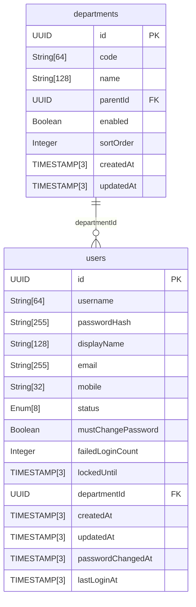

### AI Providers（供应商配置）

`ai_providers` 模块（5 张表）。

```mermaid
erDiagram

    ai_call_logs {
        UUID id  PK
        String[64] traceId 
        UUID providerId  FK
        String[128] providerNameSnapshot 
        String[128] modelSnapshot 
        Enum[15] scene 
        Integer inputTokens 
        Integer outputTokens 
        Integer totalTokens 
        Integer durationMs 
        Enum[7] result 
        String[128] errorCode 
        String[500] errorSummary 
        UUID actorUserId  FK
        TIMESTAMP[3] createdAt 
    }

    ai_model_configs {
        UUID id  PK
        UUID accountId  FK
        String[128] modelName 
        Boolean enabled 
        Boolean isDefault 
        Integer priority 
        Integer timeoutSeconds 
        Enum[12] health 
        TIMESTAMP[3] lastHealthAt 
        String[64] lastHealthErrorCode 
        TIMESTAMP[3] createdAt 
        TIMESTAMP[3] updatedAt 
    }

    ai_provider_accounts {
        UUID id  PK
        String[128] name 
        Enum[17] providerType 
        Text encryptedApiKey 
        String[16] keyLast4 
        Boolean enabled 
        Enum[16] health 
        TIMESTAMP[3] lastHealthAt 
        String[64] lastHealthErrorCode 
        UUID createdById  FK
        UUID updatedById  FK
        TIMESTAMP[3] createdAt 
        TIMESTAMP[3] updatedAt 
    }

    ai_provider_configs {
        UUID id  PK
        String[128] name 
        String[128] vendor 
        String[500] endpoint 
        Enum[23] protocol 
        String[128] model 
        Text encryptedApiKey 
        String[64] keyIv 
        String[64] keyAuthTag 
        String[16] keyLast4 
        Date expiresAt 
        Integer timeoutSeconds 
        Integer retryCount 
        Boolean enabled 
        Boolean isDefault 
        Integer priority 
        Enum[8] lastTestStatus 
        TIMESTAMP[3] lastTestAt 
        Integer lastTestLatencyMs 
        String[128] lastTestErrorCode 
        UUID createdById  FK
        UUID updatedById  FK
        TIMESTAMP[3] createdAt 
        TIMESTAMP[3] updatedAt 
    }

    ai_provider_v2_call_logs {
        UUID id  PK
        UUID accountId  FK
        UUID modelConfigId  FK
        String[128] accountNameSnapshot 
        String[128] modelNameSnapshot 
        Integer httpStatus 
        Integer durationMs 
        Integer inputTokens 
        Integer outputTokens 
        Integer totalTokens 
        Enum[7] result 
        String[64] errorClassification 
        TIMESTAMP[3] createdAt 
    }

    users {
        UUID id  PK
        String[64] username 
        String[255] passwordHash 
        String[128] displayName 
        String[255] email 
        String[32] mobile 
        Enum[8] status 
        Boolean mustChangePassword 
        Integer failedLoginCount 
        TIMESTAMP[3] lockedUntil 
        UUID departmentId  FK
        TIMESTAMP[3] createdAt 
        TIMESTAMP[3] updatedAt 
        TIMESTAMP[3] passwordChangedAt 
        TIMESTAMP[3] lastLoginAt 
    }

    users ||--o{ ai_call_logs : "actorUserId"
    ai_provider_configs ||--o{ ai_call_logs : "providerId"
    ai_provider_accounts ||--o{ ai_model_configs : "accountId"
    users ||--o{ ai_provider_accounts : "createdById"
    users ||--o{ ai_provider_accounts : "updatedById"
    users ||--o{ ai_provider_configs : "createdById"
    users ||--o{ ai_provider_configs : "updatedById"
    ai_model_configs ||--o{ ai_provider_v2_call_logs : "modelConfigId"
    ai_provider_accounts ||--o{ ai_provider_v2_call_logs : "accountId"
    departments ||--o{ users : "departmentId"
```

### Audit（审计链）

`audit` 模块（1 张表）。

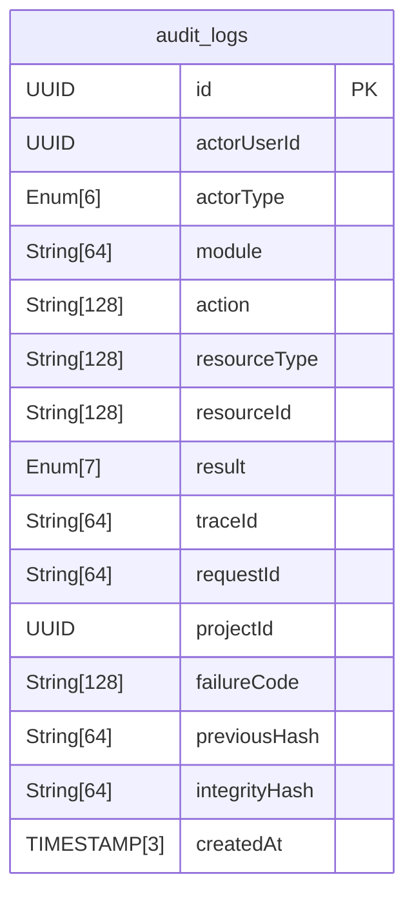

### Auth（登录会话）

`auth` 模块（1 张表）。

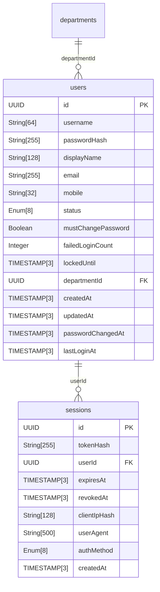

### Imports（Excel 导入）

`imports` 模块（4 张表）。

```mermaid
erDiagram

    durable_tasks {
        UUID id  PK
        Enum[22] kind 
        Enum[10] status 
        String[255] idempotencyKey 
        JSONB payload 
        Integer attemptCount 
        Integer maxAttempts 
        TIMESTAMP[3] nextRetryAt 
        UUID leaseToken 
        String[255] leaseOwner 
        TIMESTAMP[3] heartbeatAt 
        TIMESTAMP[3] leaseExpiresAt 
        Integer dispatchGeneration 
        String[128] failureCode 
        Text failureSummary 
        TIMESTAMP[3] startedAt 
        TIMESTAMP[3] completedAt 
        TIMESTAMP[3] createdAt 
        TIMESTAMP[3] updatedAt 
    }

    import_batches {
        UUID id  PK
        UUID taskId  FK
        String[255] fileName 
        String[64] fileHash 
        String[500] storageKey 
        Enum[11] status 
        String[128] sheetName 
        JSONB sourceMeta 
        Integer totalRows 
        Integer readyRows 
        Integer warningRows 
        Integer errorRows 
        Integer createdRows 
        Integer updatedRows 
        Integer supplementalTotalRows 
        Integer supplementalMatchedRows 
        Integer supplementalUnmatchedRows 
        Integer supplementalAmbiguousRows 
        Integer supplementalWarningRows 
        Integer supplementalErrorRows 
        Integer legalTotalRows 
        Integer legalMatchedRows 
        Integer legalUnmatchedRows 
        Integer legalAmbiguousRows 
        Integer legalWarningRows 
        Integer legalErrorRows 
        UUID uploadedById  FK
        UUID confirmedById  FK
        UUID rolledBackById  FK
        TIMESTAMP[3] sourceExpiresAt 
        TIMESTAMP[3] rollbackProtectedUntil 
        String[32] retentionConfigVersion 
        TIMESTAMP[3] createdAt 
        TIMESTAMP[3] confirmedAt 
        TIMESTAMP[3] rolledBackAt 
    }

    legal_matter_rows {
        UUID id  PK
        UUID batchId  FK
        Integer rowNumber 
        String[128] sourceSheet 
        String[64] sourceKey 
        Enum[11] status 
        Enum[9] matchStatus 
        String[64] matchedImportKey 
        UUID projectId  FK
        String[128] externalCode 
        String[500] projectName 
        String[128] departmentName 
        String[128] deliveryOwnerName 
        Numeric[18][2] annualPlanAmount 
        Enum[7] collectionRiskLevel 
        Text legalProgress 
        JSONB monthlyCollections 
        JSONB monthAttributes 
        JSONB sourceSnapshot 
        JSONB warnings 
        JSONB errors 
        UUID committedRiskId 
        JSONB beforeRiskSnapshot 
        JSONB afterRiskSnapshot 
        TIMESTAMP[3] createdAt 
        TIMESTAMP[3] updatedAt 
    }

    project_import_rows {
        UUID id  PK
        UUID batchId  FK
        Integer rowNumber 
        String[64] importKey 
        Enum[6] action 
        Enum[11] status 
        String[128] externalCode 
        String[255] projectName 
        String[128] departmentName 
        String[128] deliveryOwnerName 
        Numeric[18][2] annualPlanAmount 
        Numeric[18][2] actualCollectedAmount 
        Numeric[18][2] remainingAmount 
        JSONB monthlyCollections 
        JSONB monthAttributes 
        Enum[7] collectionRiskLevel 
        Text collectionProgress 
        JSONB sourceSnapshot 
        JSONB warnings 
        JSONB errors 
        UUID matchedProjectId  FK
        UUID committedProjectId  FK
        JSONB beforeSnapshot 
        JSONB afterSnapshot 
        UUID committedRiskId 
        JSONB beforeRiskSnapshot 
        JSONB afterRiskSnapshot 
        TIMESTAMP[3] createdAt 
        TIMESTAMP[3] updatedAt 
    }

    projects {
        UUID id  PK
        String[128] externalCode 
        String[64] importKey 
        String[255] name 
        String[255] alias 
        Enum[9] status 
        UUID departmentId  FK
        UUID managerId  FK
        String[128] deliveryOwnerName 
        Numeric[18][2] annualPlanAmount 
        Numeric[18][2] actualCollectedAmount 
        Numeric[18][2] remainingAmount 
        JSONB monthlyCollections 
        JSONB monthAttributes 
        Enum[7] collectionRiskLevel 
        Text collectionProgress 
        TIMESTAMP[3] lastImportedAt 
        Integer sourceVersion 
        TIMESTAMP[3] createdAt 
        TIMESTAMP[3] updatedAt 
    }

    supplemental_collection_rows {
        UUID id  PK
        UUID batchId  FK
        Integer rowNumber 
        String[128] sourceSheet 
        String[64] sourceKey 
        Enum[11] status 
        Enum[9] matchStatus 
        String[64] matchedImportKey 
        UUID projectId  FK
        String[128] externalCode 
        String[500] projectName 
        Numeric[18][2] contractReceivableAmount 
        Numeric[18][2] procurementContractAmount 
        Numeric[18][2] cumulativeCollectedAmount 
        Numeric[18][2] remainingUncollectedAmount 
        Numeric[18][2] actualCollectedThisYear 
        Numeric[18][2] actualCollectedNetThisYear 
        Numeric[18][2] annualCollectionPlan 
        Enum[7] collectionRiskLevel 
        JSONB monthlyCollections 
        JSONB monthAttributes 
        Numeric[18][2] afterYearAmount 
        JSONB sourceSnapshot 
        JSONB warnings 
        JSONB errors 
        TIMESTAMP[3] createdAt 
        TIMESTAMP[3] updatedAt 
    }

    users {
        UUID id  PK
        String[64] username 
        String[255] passwordHash 
        String[128] displayName 
        String[255] email 
        String[32] mobile 
        Enum[8] status 
        Boolean mustChangePassword 
        Integer failedLoginCount 
        TIMESTAMP[3] lockedUntil 
        UUID departmentId  FK
        TIMESTAMP[3] createdAt 
        TIMESTAMP[3] updatedAt 
        TIMESTAMP[3] passwordChangedAt 
        TIMESTAMP[3] lastLoginAt 
    }

    durable_tasks ||--o{ import_batches : "taskId"
    users ||--o{ import_batches : "rolledBackById"
    users ||--o{ import_batches : "confirmedById"
    users ||--o{ import_batches : "uploadedById"
    import_batches ||--o{ legal_matter_rows : "batchId"
    projects ||--o{ legal_matter_rows : "projectId"
    projects ||--o{ project_import_rows : "matchedProjectId"
    projects ||--o{ project_import_rows : "committedProjectId"
    import_batches ||--o{ project_import_rows : "batchId"
    users ||--o{ projects : "managerId"
    departments ||--o{ projects : "departmentId"
    projects ||--o{ supplemental_collection_rows : "projectId"
    import_batches ||--o{ supplemental_collection_rows : "batchId"
    departments ||--o{ users : "departmentId"
```

### Mailbox（邮箱同步）

`mailbox` 模块（6 张表）。

```mermaid
erDiagram

    durable_tasks {
        UUID id  PK
        Enum[22] kind 
        Enum[10] status 
        String[255] idempotencyKey 
        JSONB payload 
        Integer attemptCount 
        Integer maxAttempts 
        TIMESTAMP[3] nextRetryAt 
        UUID leaseToken 
        String[255] leaseOwner 
        TIMESTAMP[3] heartbeatAt 
        TIMESTAMP[3] leaseExpiresAt 
        Integer dispatchGeneration 
        String[128] failureCode 
        Text failureSummary 
        TIMESTAMP[3] startedAt 
        TIMESTAMP[3] completedAt 
        TIMESTAMP[3] createdAt 
        TIMESTAMP[3] updatedAt 
    }

    mail_message_project_matches {
        UUID id  PK
        UUID messageId  FK
        UUID projectId  FK
        Enum[6] matchType 
        Integer confidence 
        String[500] matchedText 
        UUID confirmedById  FK
        TIMESTAMP[3] createdAt 
    }

    mail_messages {
        UUID id  PK
        UUID mailboxConfigId  FK
        UUID batchId  FK
        String[500] messageId 
        BigInteger uidValidity 
        BigInteger imapUid 
        String[500] subject 
        String[255] senderName 
        String[255] senderAddress 
        TIMESTAMP[3] sentAt 
        TIMESTAMP[3] receivedAt 
        Enum[25] receivedAtSource 
        TIMESTAMP[3] processedAt 
        Enum[9] status 
        Enum[13] skipReason 
        String[128] failureCode 
        String[500] failureSummary 
        Text sanitizedSummary 
        JSONB keyPoints 
        JSONB attachmentMetadata 
        JSONB processingTrace 
        Enum[20] projectResolutionStatus 
        UUID resolvedProjectId  FK
        JSONB projectResolutionCandidates 
        Integer projectResolutionConfidence 
        UUID projectResolutionConfirmedById  FK
        Integer retryCount 
        TIMESTAMP[3] createdAt 
        TIMESTAMP[3] updatedAt 
    }

    mail_risk_candidates {
        UUID id  PK
        UUID messageId  FK
        UUID projectId  FK
        UUID categoryId  FK
        Enum[7] level 
        Text description 
        Text evidence 
        Text suggestion 
        Integer confidence 
        Enum[9] status 
        UUID confirmedRiskId  FK
        UUID reviewedById  FK
        TIMESTAMP[3] reviewedAt 
        TIMESTAMP[3] createdAt 
        TIMESTAMP[3] updatedAt 
    }

    mail_source_handoffs {
        UUID id  PK
        UUID mailboxConfigId  FK
        UUID batchId  FK
        UUID parseTaskId  FK
        BigInteger uidValidity 
        BigInteger imapUid 
        String[500] messageId 
        TIMESTAMP[3] sentAt 
        TIMESTAMP[3] receivedAt 
        Enum[25] receivedAtSource 
        JSONB envelopeMetadata 
        Enum[17] fetchStatus 
        Enum[17] handoffStatus 
        Enum[17] parseStatus 
        Enum[17] aiReviewStatus 
        String[128] failureCode 
        String[500] failureSummary 
        TIMESTAMP[3] createdAt 
        TIMESTAMP[3] updatedAt 
    }

    mail_sync_batches {
        UUID id  PK
        UUID taskId  FK
        String[64] code 
        UUID mailboxConfigId  FK
        Enum[9] trigger 
        Enum[7] status 
        UUID operatorUserId  FK
        TIMESTAMP[3] startedAt 
        TIMESTAMP[3] finishedAt 
        Integer durationMs 
        Integer scannedCount 
        Integer newCount 
        Integer successCount 
        Integer skippedCount 
        Integer failedCount 
        Integer riskCandidateCount 
        BigInteger startUid 
        BigInteger endUid 
        String[500] errorSummary 
        UUID retryOfId  FK
        UUID targetMessageId  FK
        BigInteger uidValidity 
        Integer discoveredCount 
        Integer handedOffCount 
        Integer downstreamPendingCount 
        Integer retryableFailedCount 
        Integer permanentlyFailedCount 
        Boolean cursorAdvanced 
        TIMESTAMP[3] createdAt 
        TIMESTAMP[3] updatedAt 
    }

    mailbox_configs {
        UUID id  PK
        UUID userId  FK
        Enum[4] provider 
        String[255] email 
        String[255] imapHost 
        Integer imapPort 
        Enum[8] encryption 
        String[255] folder 
        Text encryptedAuthCode 
        String[64] authCodeIv 
        String[64] authCodeTag 
        String[16] authCodeLast4 
        JSONB subjectKeywords 
        String[255] senderRule 
        Integer initialSyncWeeks 
        Boolean readAttachments 
        Boolean aiExtractionEnabled 
        Boolean enabled 
        Boolean autoSyncEnabled 
        BigInteger uidValidity 
        BigInteger uidCursor 
        Enum[8] connectionStatus 
        TIMESTAMP[3] lastTestAt 
        Integer lastTestLatencyMs 
        String[128] lastTestErrorCode 
        String[500] lastTestErrorSummary 
        TIMESTAMP[3] lastSyncAt 
        Enum[7] lastSyncStatus 
        Integer lastSyncNewCount 
        Integer lastSyncSuccessCount 
        Integer lastSyncRiskCandidateCount 
        Integer lastSyncFailedCount 
        TIMESTAMP[3] createdAt 
        TIMESTAMP[3] updatedAt 
    }

    projects {
        UUID id  PK
        String[128] externalCode 
        String[64] importKey 
        String[255] name 
        String[255] alias 
        Enum[9] status 
        UUID departmentId  FK
        UUID managerId  FK
        String[128] deliveryOwnerName 
        Numeric[18][2] annualPlanAmount 
        Numeric[18][2] actualCollectedAmount 
        Numeric[18][2] remainingAmount 
        JSONB monthlyCollections 
        JSONB monthAttributes 
        Enum[7] collectionRiskLevel 
        Text collectionProgress 
        TIMESTAMP[3] lastImportedAt 
        Integer sourceVersion 
        TIMESTAMP[3] createdAt 
        TIMESTAMP[3] updatedAt 
    }

    risk_categories {
        UUID id  PK
        String[64] code 
        String[128] name 
        JSONB keywords 
        String[16] colorToken 
        String[500] description 
        Enum[7] defaultLevel 
        Integer sortOrder 
        Boolean isActive 
        TIMESTAMP[3] createdAt 
        TIMESTAMP[3] updatedAt 
    }

    risks {
        UUID id  PK
        UUID projectId  FK
        UUID categoryId  FK
        String[250] title 
        Text description 
        Text evidence 
        Enum[7] level 
        Enum[8] status 
        Enum[10] sourceType 
        UUID sourceBatchId  FK
        UUID sourceRefId 
        UUID reporterUserId  FK
        String[100] reporterNameSource 
        String[20] weekCode 
        Text suggestion 
        TIMESTAMP[3] detectedAt 
        TIMESTAMP[3] resolvedAt 
        UUID resolvedById  FK
        Text resolutionReason 
        String[64] dedupeFingerprint 
        TIMESTAMP[3] createdAt 
        TIMESTAMP[3] updatedAt 
    }

    users {
        UUID id  PK
        String[64] username 
        String[255] passwordHash 
        String[128] displayName 
        String[255] email 
        String[32] mobile 
        Enum[8] status 
        Boolean mustChangePassword 
        Integer failedLoginCount 
        TIMESTAMP[3] lockedUntil 
        UUID departmentId  FK
        TIMESTAMP[3] createdAt 
        TIMESTAMP[3] updatedAt 
        TIMESTAMP[3] passwordChangedAt 
        TIMESTAMP[3] lastLoginAt 
    }

    projects ||--o{ mail_message_project_matches : "projectId"
    mail_messages ||--o{ mail_message_project_matches : "messageId"
    users ||--o{ mail_message_project_matches : "confirmedById"
    mail_sync_batches ||--o{ mail_messages : "batchId"
    projects ||--o{ mail_messages : "resolvedProjectId"
    users ||--o{ mail_messages : "projectResolutionConfirmedById"
    mailbox_configs ||--o{ mail_messages : "mailboxConfigId"
    risks ||--o{ mail_risk_candidates : "confirmedRiskId"
    users ||--o{ mail_risk_candidates : "reviewedById"
    mail_messages ||--o{ mail_risk_candidates : "messageId"
    projects ||--o{ mail_risk_candidates : "projectId"
    risk_categories ||--o{ mail_risk_candidates : "categoryId"
    mail_sync_batches ||--o{ mail_source_handoffs : "batchId"
    durable_tasks ||--o{ mail_source_handoffs : "parseTaskId"
    mailbox_configs ||--o{ mail_source_handoffs : "mailboxConfigId"
    mail_messages ||--o{ mail_sync_batches : "targetMessageId"
    users ||--o{ mail_sync_batches : "operatorUserId"
    durable_tasks ||--o{ mail_sync_batches : "taskId"
    mailbox_configs ||--o{ mail_sync_batches : "mailboxConfigId"
    users ||--o{ mailbox_configs : "userId"
    users ||--o{ projects : "managerId"
    departments ||--o{ projects : "departmentId"
    import_batches ||--o{ risks : "sourceBatchId"
    users ||--o{ risks : "reporterUserId"
    projects ||--o{ risks : "projectId"
    users ||--o{ risks : "resolvedById"
    risk_categories ||--o{ risks : "categoryId"
    departments ||--o{ users : "departmentId"
```

### Projects（项目）

`projects` 模块（2 张表）。

```mermaid
erDiagram

    departments {
        UUID id  PK
        String[64] code 
        String[128] name 
        UUID parentId  FK
        Boolean enabled 
        Integer sortOrder 
        TIMESTAMP[3] createdAt 
        TIMESTAMP[3] updatedAt 
    }

    project_aliases {
        UUID id  PK
        UUID projectId  FK
        String[255] alias 
        String[255] normalizedAlias 
        String[64] source 
        String[500] note 
        Boolean isActive 
        Integer hitCount 
        TIMESTAMP[3] lastHitAt 
        TIMESTAMP[3] createdAt 
        TIMESTAMP[3] updatedAt 
    }

    projects {
        UUID id  PK
        String[128] externalCode 
        String[64] importKey 
        String[255] name 
        String[255] alias 
        Enum[9] status 
        UUID departmentId  FK
        UUID managerId  FK
        String[128] deliveryOwnerName 
        Numeric[18][2] annualPlanAmount 
        Numeric[18][2] actualCollectedAmount 
        Numeric[18][2] remainingAmount 
        JSONB monthlyCollections 
        JSONB monthAttributes 
        Enum[7] collectionRiskLevel 
        Text collectionProgress 
        TIMESTAMP[3] lastImportedAt 
        Integer sourceVersion 
        TIMESTAMP[3] createdAt 
        TIMESTAMP[3] updatedAt 
    }

    users {
        UUID id  PK
        String[64] username 
        String[255] passwordHash 
        String[128] displayName 
        String[255] email 
        String[32] mobile 
        Enum[8] status 
        Boolean mustChangePassword 
        Integer failedLoginCount 
        TIMESTAMP[3] lockedUntil 
        UUID departmentId  FK
        TIMESTAMP[3] createdAt 
        TIMESTAMP[3] updatedAt 
        TIMESTAMP[3] passwordChangedAt 
        TIMESTAMP[3] lastLoginAt 
    }

    projects ||--o{ project_aliases : "projectId"
    users ||--o{ projects : "managerId"
    departments ||--o{ projects : "departmentId"
    departments ||--o{ users : "departmentId"
```

### RBAC（权限）

`rbac` 模块（5 张表）。

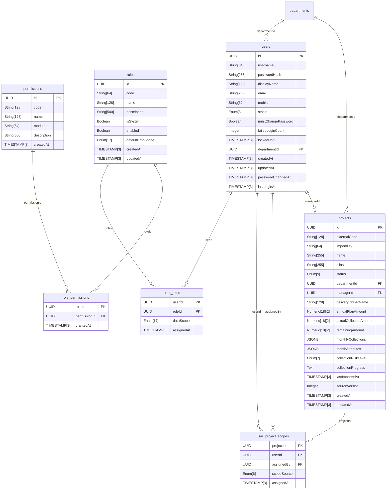

### Reliability（持久任务）

`reliability` 模块（2 张表）。

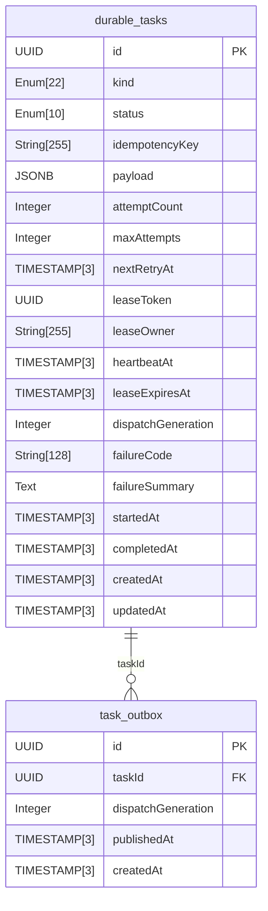

### Retention（留存保护）

`retention` 模块（1 张表）。

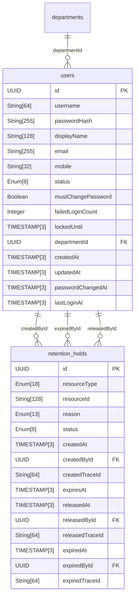

### Risks（风险）

`risks` 模块（2 张表）。

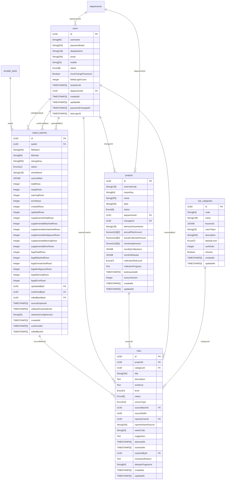

### System Config（系统配置）

`system_config` 模块（2 张表）。

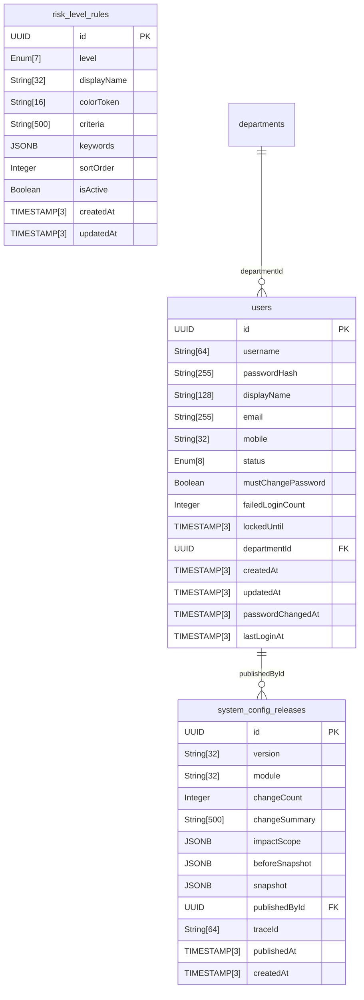

### Timeline（时间线）

`timeline` 模块（1 张表）。

```mermaid
erDiagram

    action_items {
        UUID id  PK
        UUID riskId  FK
        Boolean isDefaultForRisk 
        UUID projectId  FK
        String[250] title 
        Text description 
        Enum[9] urgency 
        Enum[11] status 
        Enum[15] sourceType 
        UUID assigneeUserId  FK
        String[128] assigneeNameSource 
        Date dueDate 
        Text completionNote 
        UUID createdById  FK
        UUID completedById  FK
        TIMESTAMP[3] completedAt 
        TIMESTAMP[3] createdAt 
        TIMESTAMP[3] updatedAt 
    }

    import_batches {
        UUID id  PK
        UUID taskId  FK
        String[255] fileName 
        String[64] fileHash 
        String[500] storageKey 
        Enum[11] status 
        String[128] sheetName 
        JSONB sourceMeta 
        Integer totalRows 
        Integer readyRows 
        Integer warningRows 
        Integer errorRows 
        Integer createdRows 
        Integer updatedRows 
        Integer supplementalTotalRows 
        Integer supplementalMatchedRows 
        Integer supplementalUnmatchedRows 
        Integer supplementalAmbiguousRows 
        Integer supplementalWarningRows 
        Integer supplementalErrorRows 
        Integer legalTotalRows 
        Integer legalMatchedRows 
        Integer legalUnmatchedRows 
        Integer legalAmbiguousRows 
        Integer legalWarningRows 
        Integer legalErrorRows 
        UUID uploadedById  FK
        UUID confirmedById  FK
        UUID rolledBackById  FK
        TIMESTAMP[3] sourceExpiresAt 
        TIMESTAMP[3] rollbackProtectedUntil 
        String[32] retentionConfigVersion 
        TIMESTAMP[3] createdAt 
        TIMESTAMP[3] confirmedAt 
        TIMESTAMP[3] rolledBackAt 
    }

    projects {
        UUID id  PK
        String[128] externalCode 
        String[64] importKey 
        String[255] name 
        String[255] alias 
        Enum[9] status 
        UUID departmentId  FK
        UUID managerId  FK
        String[128] deliveryOwnerName 
        Numeric[18][2] annualPlanAmount 
        Numeric[18][2] actualCollectedAmount 
        Numeric[18][2] remainingAmount 
        JSONB monthlyCollections 
        JSONB monthAttributes 
        Enum[7] collectionRiskLevel 
        Text collectionProgress 
        TIMESTAMP[3] lastImportedAt 
        Integer sourceVersion 
        TIMESTAMP[3] createdAt 
        TIMESTAMP[3] updatedAt 
    }

    risk_timeline_events {
        UUID id  PK
        UUID projectId  FK
        UUID riskId  FK
        UUID actionItemId  FK
        Enum[21] eventType 
        String[250] title 
        Text description 
        String[128] fromValue 
        String[128] toValue 
        UUID actorUserId  FK
        String[128] actorNameSource 
        UUID sourceBatchId  FK
        TIMESTAMP[3] occurredAt 
        JSONB metadata 
        TIMESTAMP[3] createdAt 
    }

    risks {
        UUID id  PK
        UUID projectId  FK
        UUID categoryId  FK
        String[250] title 
        Text description 
        Text evidence 
        Enum[7] level 
        Enum[8] status 
        Enum[10] sourceType 
        UUID sourceBatchId  FK
        UUID sourceRefId 
        UUID reporterUserId  FK
        String[100] reporterNameSource 
        String[20] weekCode 
        Text suggestion 
        TIMESTAMP[3] detectedAt 
        TIMESTAMP[3] resolvedAt 
        UUID resolvedById  FK
        Text resolutionReason 
        String[64] dedupeFingerprint 
        TIMESTAMP[3] createdAt 
        TIMESTAMP[3] updatedAt 
    }

    users {
        UUID id  PK
        String[64] username 
        String[255] passwordHash 
        String[128] displayName 
        String[255] email 
        String[32] mobile 
        Enum[8] status 
        Boolean mustChangePassword 
        Integer failedLoginCount 
        TIMESTAMP[3] lockedUntil 
        UUID departmentId  FK
        TIMESTAMP[3] createdAt 
        TIMESTAMP[3] updatedAt 
        TIMESTAMP[3] passwordChangedAt 
        TIMESTAMP[3] lastLoginAt 
    }

    projects ||--o{ action_items : "projectId"
    users ||--o{ action_items : "createdById"
    users ||--o{ action_items : "assigneeUserId"
    users ||--o{ action_items : "completedById"
    risks ||--o{ action_items : "riskId"
    durable_tasks ||--o{ import_batches : "taskId"
    users ||--o{ import_batches : "rolledBackById"
    users ||--o{ import_batches : "confirmedById"
    users ||--o{ import_batches : "uploadedById"
    users ||--o{ projects : "managerId"
    departments ||--o{ projects : "departmentId"
    projects ||--o{ risk_timeline_events : "projectId"
    users ||--o{ risk_timeline_events : "actorUserId"
    risks ||--o{ risk_timeline_events : "riskId"
    action_items ||--o{ risk_timeline_events : "actionItemId"
    import_batches ||--o{ risk_timeline_events : "sourceBatchId"
    import_batches ||--o{ risks : "sourceBatchId"
    users ||--o{ risks : "reporterUserId"
    projects ||--o{ risks : "projectId"
    users ||--o{ risks : "resolvedById"
    risk_categories ||--o{ risks : "categoryId"
    departments ||--o{ users : "departmentId"
```

### Todos（待办）

`todos` 模块（1 张表）。

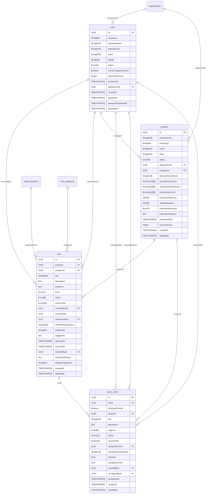

### Weekly Reports（周报）

`weekly_reports` 模块（2 张表）。

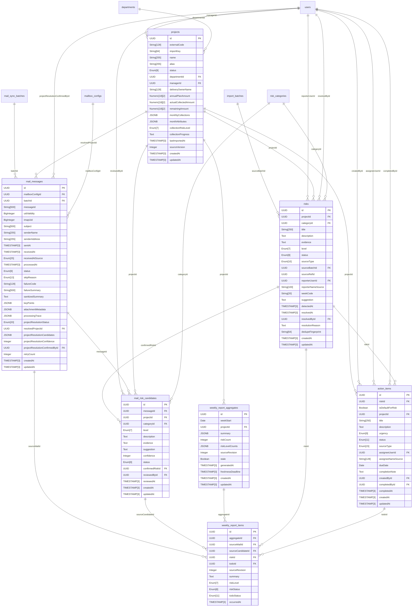
