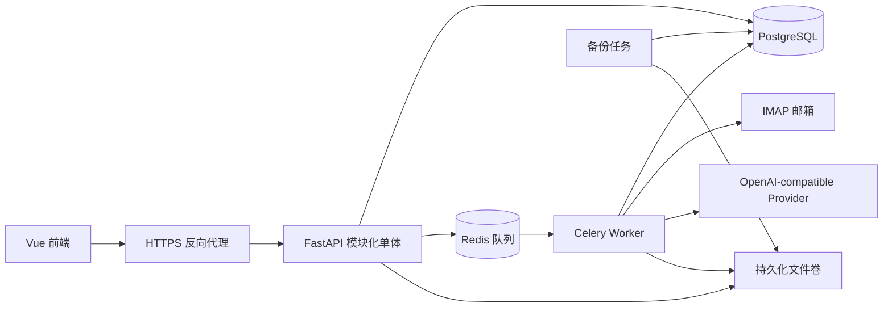

# FastAPI 后端重写设计

状态：待最终确认  
日期：2026-08-10

## 1. 目标

在保留现有前端交互和 `/api` 契约的前提下，使用 Python FastAPI 重写项目风险管理平台后端。交付物是可持续开发的完整 MVP，而非一次性演示：覆盖现有功能，并补齐服务端 Agent、真实周报联动和管理概览动态数据。

当前系统尚未投入正式使用。NestJS 后端仅作为行为、数据库模型和测试参照；正式上线只运行 Python 后端，不做生产双写或旧数据迁移。

## 2. 需求依据

需求冲突按以下顺序处理：

1. 已确认的访谈决定与 ADR；
2. 当前前端可见行为和共享 TypeScript 契约；
3. 最新有效设计文档；
4. NestJS 后端实现及测试，用于解释现有行为。

涉及业务语义的新增冲突必须重新确认，不能由实现自行猜测。

## 3. 范围

### 包含

- 本地账号、Cookie 会话、首次登录强制改密和失败锁定；
- 用户、角色、权限和五种项目数据范围；
- 项目清单及回款 Excel 预览、确认、历史、下载和回滚；
- 风险看板、风险详情、统计、重点关注、回款、待办和时间线；
- 风险上报、解除、重新打开及关联联动；
- 系统配置版本、风险类别与等级规则、项目别名；
- AI Provider、审计日志、邮箱配置和邮箱同步结果；
- 周报真实汇总、项目匹配、风险候选复核与发布；
- Agent 查询、上报、处理、解除、帮助和流式反馈；
- 管理概览的真实健康状态、待处理事项和审计动态；
- OpenAPI、自动化测试、容器部署、备份和恢复脚本。

### 不包含

- SQLite、微服务、Kubernetes、多实例高可用；
- 企业 SSO、多租户、计费、复杂审批、独立 BI 或独立任务中心；
- “指定部门”项目数据范围；
- 风险的“新增/持续/缓解中”多阶段状态；
- 完整邮件原文和附件的长期留存；
- 生产环境中的 NestJS 后端或新旧双写。

## 4. 架构

正式环境使用 Python 3.12、FastAPI、Pydantic v2、SQLAlchemy 2、Alembic、psycopg 3、Celery、Redis 和 PostgreSQL。依赖由 uv 锁定；pytest、Ruff 和 mypy 作为质量门槛。

代码采用模块化单体，建议在 `project-risk-system/apps/api-python/` 中并行建设，至少包含：

- `auth`：认证、会话、密码策略；
- `rbac`：权限和项目数据范围；
- `admin`：用户、角色和管理概览；
- `imports`：Excel 导入、版本和回滚；
- `projects`：项目、回款和项目别名；
- `risks`：风险生命周期、候选和联动；
- `todos`：管理者待办；
- `timeline`：风险时间线；
- `system_config`：配置草稿、发布和回滚；
- `ai_providers`：Provider 配置、健康检查和调用记录；
- `mailbox`：邮箱配置、同步、解析和重试；
- `agent`：会话、受限工具、预览和确认；
- `audit`：追加式审计与完整性检查；
- `shared`：错误、分页、追踪、幂等、事务和安全基础设施。

模块通过服务边界协作，不跨模块随意访问数据表。API 与 Worker 共享领域规则，但以独立进程运行。

## 5. 数据与契约

- PostgreSQL 是唯一正式数据库；不使用 SQLite 作为本地替代，避免行为差异。
- 用户、权限、项目、导入、风险、待办、邮箱和审计等核心结构保持与现有 Prisma 模型兼容。
- Agent 会话、消息、有序事件、一次性确认凭证和周报聚合采用新增表；字段、公开 API、确认和 SSE 契约以 ADR 0019 为准，执行/领域命令以 ADR 0020 为准，周报物化生命周期以 ADR 0021 为准。
- Alembic 以当前结构建立基线，后续所有结构变化均通过显式迁移完成。
- 数据库统一保存 UTC 时间，界面业务时间按 `Asia/Shanghai` 展示。
- 风险只在 `ACTIVE`（跟踪中）与 `RESOLVED`（已解除）之间流转；处置阶段由待办和时间线表达。
- 项目数据范围保持 `ALL`、`OWNED`、`ASSIGNED`、`OWNED_OR_ASSIGNED`、`NONE`。
- 迁移期间，现有 TypeScript 类型与前端行为是契约基准；切换后以 FastAPI OpenAPI 为唯一来源并生成前端类型。
- 现有数据库只有演示数据，正式环境由 Alembic 和可重复 Seed 初始化。
- 持久化后台任务采用 ADR 0018 定义的统一 `durable_tasks` + `task_outbox` 契约；领域批次以 `task_id NOT NULL UNIQUE` 外键引用 `durable_tasks.id`，删除行为为 `RESTRICT`，任务基础设施不反向保存领域表的多态引用。

## 6. 关键业务流程

### Excel 导入

1. 上传原文件并创建导入批次；
2. 后台解析、校验并生成预览；
3. 用户确认后在事务中写入正式数据；
4. 成功版本成为看板与 Agent 的数据源；
5. 失败批次不影响当前版本，已提交批次可按规则回滚；
6. 原文件默认保留一年，到期安全删除，批次和审计记录继续保留。

### 邮箱与周报

1. 风险管理员配置自己的只读 IMAP 邮箱；
2. Worker 按 UID 增量同步并执行去重、规则判断、正文清洗和受限附件解析；
3. 通过标准项目名和项目别名匹配项目；
4. 调用已启用且健康的 AI Provider 生成结构化风险候选；
5. 候选经风险管理员调整、忽略或确认；
6. 确认在单个事务中产生正式风险、时间线、管理者待办和审计事件；
7. 看板、周报汇总和 Agent 查询读取最新业务状态。

系统只长期保存安全摘要、关键要点、必要证据摘录和附件元数据。重新分析时按 IMAP UID 获取原邮件；原邮件已删除时明确报告不可重试。

“本周周报”按上海时区周一 00:00 至下周一 00:00 计算，优先使用邮件发送时间，缺失时使用接收时间；延迟同步不改变所属周。

### Agent

1. 用户发起或继续一个最多保留 90 天的会话；
2. 模型识别意图并选择白名单业务工具，禁止任意 SQL；
3. 查询工具每次重新执行权限和项目数据范围过滤；
4. 文本、进度和结构化预览通过 SSE 返回；事件由 PostgreSQL 有序持久化，支持 cursor 补发，具体 event/断线契约以 ADR 0019 为准；
5. 上报、处理或解除先生成预览，不在流式响应中写入；
6. 用户通过 REST 提交绑定用户、会话和内容的一次性短效确认凭证；
7. 服务在事务中执行幂等写入、关联联动和审计；上报、处理、解除的精确定义以 ADR 0020 为准；
8. 回答包含业务依据、数据时间和追踪编号。

AI 不可用时明确失败并允许重试；非 AI 看板、导入和风险维护功能继续可用。

## 7. 安全与审计

- 内网仍通过 HTTPS 访问，反向代理负责 TLS 和安全响应头；
- 密码使用强哈希，Cookie 设置 `HttpOnly`、`Secure` 和适当的 `SameSite`；
- 邮箱授权码与 AI 密钥在数据库中加密，主密钥和会话密钥从 Docker Secret 或只读文件注入；
- Provider 和 IMAP 地址经过允许范围、DNS/IP 与 SSRF 校验；
- 邮件附件、Excel 和模型输出均是不可信输入，限制类型、大小、解析时间和输出结构；
- 审计日志只增不改，由 PostgreSQL 触发器连接哈希链；
- Audit 采用 metadata-only 模型，只记录固定 typed fields：时间、actor、action、resource、result、
  trace/request，以及必要的 project/failure code；
- Audit write interface 不接受 snapshot、arbitrary JSON metadata、业务 payload、request/response body、
  邮件/附件内容、prompt、模型原始响应或 secret/credential，因此 Audit 不再需要 redaction system；
- 提供链完整性检查和 metadata-only 导出，导出行为本身也被审计；
- 日志和 AI 调用记录仍不得保存完整密钥、邮件、附件文本、提示词或模型原始响应。

## 8. 任务可靠性

- Excel、邮箱、附件解析和 AI 调用由 Celery Worker 执行；
- PostgreSQL 保存业务任务状态，Redis 仅传递任务消息；
- 任务具有幂等键、超时、有限重试、退避、并发限制和失败原因；
- Worker 重启后根据数据库状态恢复遗漏任务；
- 同一邮箱同一时刻只能有一个同步批次；失败邮件可单封重试，失败批次不得错误推进 UID 游标；
- 临时文件无论成功、失败或重启都必须清理。
- durable task 状态固定为 `QUEUED`、`RUNNING`、`RETRY_WAIT`、`SUCCEEDED`、`FAILED`、`CANCELLED`；状态迁移使用带预期旧状态和适用 lease token 的 repository 原子条件更新。
- PostgreSQL 通过 `UNIQUE(kind, idempotency_key)` 强制任务创建幂等性；task payload 只保存小型标识符和执行配置，不保存文件、邮件正文、大型业务内容或领域结果。
- PostgreSQL transactional outbox 提供 at-least-once 投递；Redis/Celery message 只携带 `task_id` 和 `dispatch_generation`。
- Worker 使用 lease token、heartbeat、expiry 和 fencing；reconciliation 负责 lost dispatch、到期 retry 和 expired lease。完整契约以 ADR 0018 为准。
- Agent AI invocation 使用 ADR 0018 durable task/outbox 由 Celery Worker 执行；Worker 先向 PostgreSQL 写入有序 event facts，SSE API 只读取这些事实。取消、heartbeat、背压和恢复以 ADR 0019/0020 为准。

## 9. 容量、备份与运行目标

- 容量基线：不超过 300 名用户、5,000 个项目、每周 1,000 封周报；
- 部署：单台内网服务器上的 Docker Compose；
- PostgreSQL 与文件存储每日加密备份；
- 保留 7 个日备份、4 个周备份和 12 个月备份；
- RPO 24 小时，RTO 4 小时；
- 上线前及此后每季度执行恢复演练；
- 管理概览健康状态来自 API、数据库、Redis、Worker 和必要外部连接的真实检查，不使用固定文案。

## 10. 实施顺序

1. **工程与契约基线**：新目录、依赖、配置、容器、统一响应、追踪、异常、健康检查、测试框架；
2. **数据库与安全基线**：SQLAlchemy 模型、Alembic、Seed、密钥加密、审计哈希链；
3. **认证与 RBAC**：登录、会话、改密、锁定、权限和项目范围；
4. **系统管理**：用户、角色、AI Provider、系统配置、审计和动态管理概览；
5. **项目与导入**：项目、回款、Excel 预览、提交、历史、下载和回滚；
6. **风险闭环**：看板、风险、待办、时间线、解除与重新打开；
7. **邮箱与 AI**：真实 IMAP、附件解析、项目匹配、候选复核和重试；
8. **Agent 与周报**：真实周报聚合、工具调用、SSE、预览和确认；
9. **前端接线**：只替换静态数据与模拟 Agent，补齐真实状态反馈；
10. **收口验收**：完整契约、权限、性能、安全、备份恢复及真实外部联调。

每阶段都保持可运行，并与现有前端和 NestJS 行为进行对照；不等待全部模块完成后才首次集成。

## 11. 完成标准

- 当前前端页面无需重设计即可使用全部目标能力；
- 现有 `/api` 的路径、字段、响应、错误、Cookie 与分页兼容；
- Agent、周报和管理概览不再依赖前端 Mock 或固定数组；
- 四个默认角色及五种项目范围均通过正向和越权测试；
- Excel、风险联动、审计、邮箱候选和 Agent 写入具有事务、回滚、幂等与失败重试测试；
- 使用真实测试邮箱和真实 AI Provider 完成端到端验收；
- 在容量基线数据集上通过查询和任务吞吐验收；
- 从备份实际恢复数据库、文件、配置关联并验证审计链；
- pytest、Ruff、mypy、契约测试、页面端到端测试、Alembic 检查和镜像构建全部通过；
- 正式 Docker Compose 只运行 Python API，不部署 NestJS API。

## 12. 实施期外部材料

以下材料不改变架构，可在对应阶段提供：

- 风险管理员真实测试邮箱及授权码；
- 至少一个真实公网或内网 OpenAI-compatible Provider；
- 内网域名、TLS 证书及出站访问策略；
- 正式环境的密钥文件、备份目标和恢复演练窗口。
