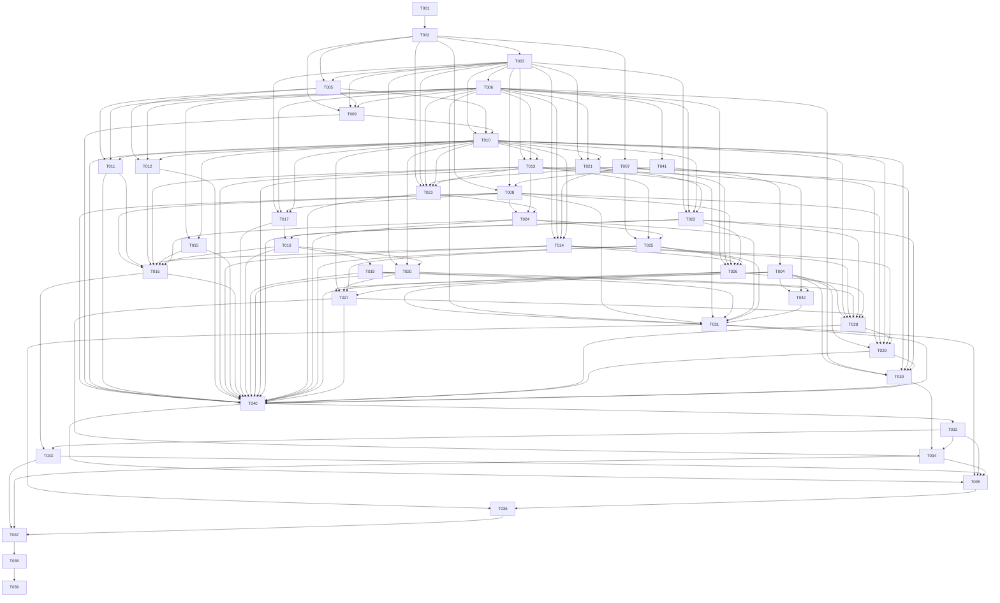

# Implementation Task Graph

## Status vocabulary

- `READY`: approved inputs are sufficient once dependencies pass.
- `BLOCKED_DESIGN_GAP`: implementation must not start until the named gap is resolved in an approved addendum/ADR and the task is updated.
- Runtime status (`TODO`, `IN_PROGRESS`, `PASS`, `FAIL`) is tracked when execution begins; all tasks here start `TODO` unless blocked.

## DAG

## Suggested execution waves

| Wave | Tasks | Parallelism and checkpoint |
|---|---|---|
| 1 | T001 | Python workspace and locked quality baseline checkpoint. |
| 2 | T002 | HTTP/configuration core and the module composition contract. |
| 3 | T003, T007 | DB/session foundation and crypto/outbound security consume T002 settings but use disjoint files. |
| 4 | T005, T006 | Seed and audit enforcement share the completed core schema but do not share a migration file. |
| 5 | T009, T041 | Authentication and the ADR 0018 durable-task migration are disjoint; both tasks are ready, but execution still requires explicit Wave 5 start. |
| 6 | T004, T008, T010 | Capability migration, worker core and RBAC are disjoint after T041/T009 pass; T004 is READY after ADRs 0019-0021. |
| 7 | T011, T012, T013, T014, T015, T017, T021 | Parallel feature submodules; each owns only its declared subpackage/tests and may consume, but not edit, shared DB/audit/task fixtures. |
| 8 | T022, T023 | Risk/todo mutation core and mailbox configuration are disjoint. |
| 9 | T018, T024 | Import commit and IMAP orchestration consume established domain/task services without modifying them. |
| 10 | T016, T019, T020, T025 | Admin overview, rollback, dashboard reads and mail parsing have disjoint module write sets; DG-01 is resolved. |
| 11 | T026, T042 | Mail candidate pipeline and retention-protection policy are disjoint; T042 is blocked on DG-04. |
| 12 | T027, T031 | Weekly-report query and retention cleanup are disjoint after their respective schemas/policies pass. |
| 13 | T028 | Authorized Agent conversations/query tools. |
| 14 | T029 | SSE answer/preview contract checkpoint. |
| 15 | T030 | One-use REST confirmation transaction checkpoint. |
| 16 | T040 | Single-owner FastAPI/Celery composition and dependency-injection checkpoint. |
| 17 | T032 | Freeze OpenAPI authority and generate reproducible frontend types. |
| 18 | T033, T034 | Admin and business frontend cutovers use disjoint page/API modules and consume, but never edit, generated types. |
| 19 | T035 | Build production Compose/proxy/images only after both frontend cutovers, avoiding image-build reads racing frontend/type writes. |
| 20 | T036 | Implement and drill backup/restore against the final production volume topology. |
| 21 | T037 | Full compatibility and security suite. |
| 22 | T038 | Blocked by DG-05 until numeric performance criteria exist; capacity/reliability validation. |
| 23 | T039 | External mailbox/provider, restore, frontend E2E and Python-only production cutover evidence. |

Tasks in a wave may run concurrently only when every dependency from an earlier wave is `PASS`; a blocked task is skipped, never treated as passed. Alembic revisions are strictly serialized in the order T003 → T006 → T041 → T004 → T042. No parallel task may create an opportunistic revision. Shared app/Celery bootstrap is owned by T002 then T040; production Compose/proxy/env examples by T035; generated OpenAPI/types by T032. Feature tasks expose module-local entry points and test them with T002/T003/T008 fixtures without editing those shared files. T037/T038 record findings only and route fixes back to the owning task.

## Task catalog

| Task | Status | Direct dependencies | One-sentence objective |
|---|---|---|---|
| T001 | READY | — | Bootstrap the locked Python 3.12 backend workspace and quality gates. |
| T002 | READY | T001 | Build FastAPI configuration, HTTP envelope, tracing and baseline request security. |
| T003 | READY | T002 | Establish Prisma-equivalent SQLAlchemy models and Alembic core baseline. |
| T004 | READY | T041 | Add approved Agent conversation, confirmation and weekly-report persistence schemas. |
| T005 | READY | T002, T003 | Seed four roles, permissions and reference data repeatably without migrating demos. |
| T006 | READY | T003 | Enforce PostgreSQL append-only audit chaining and a fixed typed metadata-only audit service. |
| T007 | READY | T002 | Provide versioned secret encryption and SSRF-safe outbound endpoint validation. |
| T008 | READY | T002, T003, T041 | Build PostgreSQL-backed Celery dispatch, retry, lease and recovery infrastructure. |
| T009 | READY | T002, T003, T005, T006 | Migrate Cookie authentication, sessions, password change and lockout. |
| T010 | READY | T003, T005, T009 | Migrate permission enforcement and all five project data scopes. |
| T011 | READY | T005, T006, T010 | Migrate user administration and project assignment APIs. |
| T012 | READY | T005, T006, T010 | Migrate role, permission and department-option administration. |
| T013 | READY | T003, T006, T010 | Migrate versioned system configuration and project aliases. |
| T014 | READY | T003, T006, T007, T010 | Migrate AI Provider administration, connection tests, strategy and safe call logs. |
| T015 | READY | T006, T010 | Migrate audit query, integrity and metadata-only export APIs. |
| T016 | READY | T008, T011-T015, T018, T024 | ADR 0023 defines the approved admin overview item contract. |
| T017 | READY | T003, T006, T008, T010 | Move safe Excel upload and three-sheet preview parsing into durable workers. |
| T018 | READY | T017, T022 | Migrate atomic import commit, history, source download and supplemental matching through shared risk/todo services. |
| T019 | REVIEW_PASSED | T018 | Migrate safe import rollback and later-write conflict handling. |
| T020 | REVIEW_PASSED | T003, T010, T018 | Migrate scoped dashboard project, collection and risk read models. |
| T021 | READY | T003, T006, T010 | Migrate manager todo queries, updates and reusable risk-to-todo rules. |
| T022 | READY | T003, T006, T010, T021 | Migrate reusable risk mutation, two-state lifecycle and append-only timeline behavior. |
| T023 | READY | T002, T003, T006, T007, T010, T013 | Migrate encrypted per-user mailbox configuration and connection testing. |
| T024 | READY | T008, T013, T023 | Implement durable scheduled/manual/retry UID synchronization. |
| T025 | READY | T007, T013, T024 | Parse mail safely and match projects under ADR 0024's fixed attachment safety policy. |
| T026 | DESIGN_GAP DG-12 | T006, T007, T008, T014, T022, T025 | Extract, review and transactionally publish mail risk candidates; Provider risk-category selection/mapping needs approval. |
| T027 | TODO | T004, T010, T020, T025, T026 | Build and expose authorized current-week report aggregates/details. |
| T028 | TODO | T004, T010, T014, T020, T022, T026, T027 | Persist Agent conversations and expose authorized read-only business tools. |
| T029 | TODO | T004, T007, T008, T010, T014, T028 | Stream Agent text, progress, errors and mutation previews over SSE. |
| T030 | TODO | T004, T006, T010, T021, T022, T029 | Execute previewed Agent writes through bound one-use REST confirmations. |
| T031 | DESIGN_GAP DG-04 | T004, T006, T008, T013, T019, T024, T025, T042 | Run auditable import/conversation/temp retention cleanup with protections. |
| T032 | TODO | T040 | Freeze OpenAPI authority and generate reproducible frontend types. |
| T033 | TODO | T016, T032 | Cut admin pages to Python APIs and remove fixed business states. |
| T034 | TODO | T027, T030, T032 | Cut dashboard, weekly reports, mailbox and Agent UI to real Python APIs. |
| T035 | Inherits gaps | T031-T034, T040 | Define production Compose, Python processes, proxy, secrets and persistence after final backend/frontend composition. |
| T036 | DESIGN_GAP DG-04/DG-08 | T031, T035 | Implement encrypted backup rotation, isolated restore and drill verification. |
| T037 | Inherits DG-04/DG-05/DG-08 | T033, T034, T036 | Prove full compatibility and security across the release candidate. |
| T038 | DESIGN_GAP DG-05 | T037 | Validate performance and resilience at the approved capacity baseline. |
| T039 | External inputs + inherits DG-04/DG-05/DG-08 | T038 | Complete real mailbox/Provider E2E, restore evidence and Python-only cutover. |
| T040 | Inherits DG-04 | T008-T031 | Compose all routers, dependencies, lifecycles and worker tasks once. |
| T041 | READY | T006 | Add the ADR 0018 durable task/outbox persistence schema. |
| T042 | DESIGN_GAP DG-04 | T004, T013, T019 | Implement approved retention configuration and deletion-protection policy. |

## Design gaps

| ID | Missing approved decision | Affected tasks | Why ADRs do not answer it |
|---|---|---|---|
| DG-01 | RESOLVED by ADR 0019: Agent/weekly/admin endpoint set, response/error shapes, permission codes/default-role grants and SSE event payloads. | T004, T016, T027-T035, T037, T039-T040 | ADR 0019 is the approved public contract. |
| DG-02 | RESOLVED by ADR 0018: `durable_tasks` + transactional `task_outbox`, domain batch → task FK, fixed state machine/idempotency, fenced leases, at-least-once dispatch and PostgreSQL reconciliation. | T008, T017, T024, T026, T031, T037-T041 | ADR 0018 supplies the approved persistence contract; Agent execution is governed by ADR 0020. |
| DG-03 | RESOLVED by ADR 0019: 10-minute token TTL, canonical binding/replay semantics, event ID/sequence and reconnect cursor behavior. | T004, T029-T035, T037, T039-T040 | ADR 0019 is the approved confirmation and SSE resume contract. |
| DG-04 | Configurable retention bounds, definition/storage of rollback window and audit hold, and deletion behavior for protected backup copies. | T031, T035-T037, T039-T040, T042 | ADR 0012 gives defaults and protections, not the state model or enforceable boundaries needed for deterministic deletion. |
| DG-05 | Numeric latency/throughput/failure-recovery acceptance thresholds at the approved capacity baseline. | T038, T039 | ADR 0009 specifies dataset size, RPO and RTO but no API/task performance PASS/FAIL thresholds. |
| DG-06 | RESOLVED by ADR 0020: all Agent AI calls run in Celery; PostgreSQL persists ordered event facts; durable task/retry, cancellation, heartbeat and backpressure rules apply. | T004, T029, T031-T035, T037, T039-T040 | ADR 0020 reconciles Worker and SSE without Redis facts. |
| DG-07 | RESOLVED by ADR 0020: `REPORT`/`PROCESS`/`RESOLVE` fields, risk/todo/timeline/audit effects, idempotency and lifecycle transitions. | T004, T029-T035, T037, T039-T040 | ADR 0020 is the approved domain-command contract. |
| DG-08 | Backup encryption/key format and rotation interface plus the PostgreSQL/file consistency mechanism used to produce a verifiable restore set. | T036, T037, T039 | ADRs require encrypted backups and restoration of DB/files/config associations, but do not select a security/consistency mechanism an independent Agent can implement without a new architecture decision. |
| DG-09 | RESOLVED by ADR 0021: PostgreSQL materialized source rows, stale/rebuild/reconciliation/freshness rules and late-mail/candidate edit week ownership. | T004, T027-T028, T032, T034-T035, T037, T039-T040 | ADR 0021 is the approved weekly aggregate lifecycle. |
| DG-10 | RESOLVED by ADR 0022: UID/UIDVALIDITY-only durable handoff, downstream refetch, separate fetch/handoff/parse/AI terminal states, crash/retry recovery, explicit UIDVALIDITY reset/rebaseline and batch cursor advancement only after all UIDs reach terminal state. | T024-T027, T031-T035, T037, T039-T040 | ADR 0022 defines the cross-task handoff while reusing ADR 0018 durable task/outbox and preserving ADR 0007 minimal content retention. |
| DG-11 | RESOLVED by ADR 0024: fixed attachment allowlist, parser isolation, MIME/content validation, input/decompression/resource bounds, temporary-file cleanup and parse-stage failure mapping. | T025-T027, T031-T035, T037-T041 | ADR 0024 makes the attachment boundary sufficiently specific for T025 without deriving a security policy from the legacy implementation. |
| DG-12 | Provider-visible risk-category selection/mapping: ADR 0025 permits only opaque project options and bounded derived mail text, but T026 requires each strictly validated candidate to reference a local `categoryId`. | T026-T027 | No approved contract says whether opaque category options, a fixed taxonomy, or another mapping can be sent to/returned by Provider; legacy category payload must not supply the decision. |

## Integration checkpoints

1. Foundation: reproducible uv environment, app boot, PostgreSQL connectivity, migration/Seed from empty DB.
2. Security core: session/RBAC/scope/audit/secret negative tests.
3. Legacy parity: each migrated module passes old-contract comparison without NestJS production dependency.
4. Async workflows: broker loss, duplicate delivery, worker restart and temp cleanup tests.
5. Business closure: import and mail candidate transactions produce coherent risk/todo/timeline/audit state.
6. Contract authority: reviewed OpenAPI, generated frontend types and page E2E.
7. Release: security/capacity/recovery/external E2E evidence and Compose containing no NestJS service.
