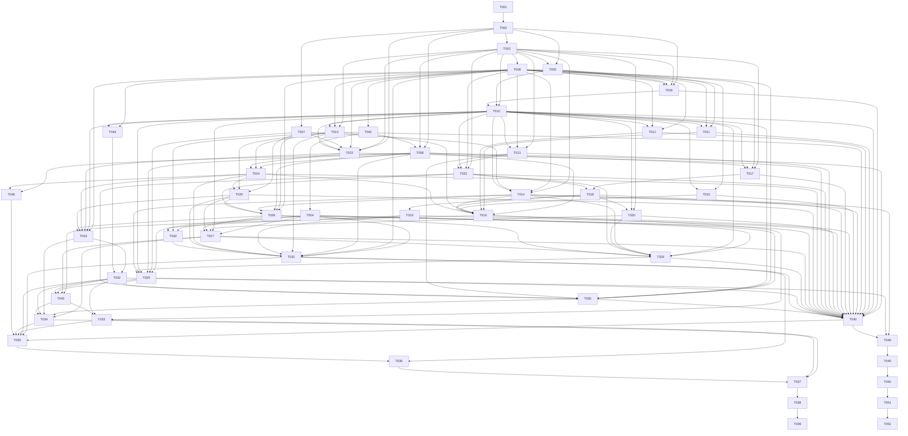

# Implementation Task Graph

## Status vocabulary

- `READY`: approved inputs are sufficient once dependencies pass.
- `BLOCKED_DESIGN_GAP`: implementation must not start until the named gap is resolved in an approved addendum/ADR and the task is updated.
- Runtime status (`TODO`, `IN_PROGRESS`, `PASS`, `FAIL`) is tracked when execution begins; all tasks here start `TODO` unless blocked.

## DAG

## Suggested execution waves

| Wave | Tasks | Parallelism and checkpoint |
|---|---|---|
| 1 | T001 | Python workspace and locked quality baseline checkpoint. |
| 2 | T002 | HTTP/configuration core and the module composition contract. |
| 3 | T003, T007 | DB/session foundation and crypto/outbound security consume T002 settings but use disjoint files. |
| 4 | T005, T006 | Seed and audit enforcement share the completed core schema but do not share a migration file. |
| 5 | T009, T041 | Authentication and the ADR 0018 durable-task migration are disjoint; both tasks are ready, but execution still requires explicit Wave 5 start. |
| 6 | T004, T008, T010 | Capability migration, worker core and RBAC are disjoint after T041/T009 pass; T004 is READY after ADRs 0019-0021. |
| 7 | T011, T012, T013, T014, T015, T017, T021 | Parallel feature submodules; each owns only its declared subpackage/tests and may consume, but not edit, shared DB/audit/task fixtures. |
| 8 | T022, T023 | Risk/todo mutation core and mailbox configuration are disjoint. |
| 9 | T018, T024 | Import commit and IMAP orchestration consume established domain/task services without modifying them. |
| 10 | T016, T019, T020, T025 | Admin overview, rollback, dashboard reads and mail parsing have disjoint module write sets; DG-01 is resolved. |
| 11 | T026, T042 | Mail candidate pipeline and retention-protection policy are disjoint; DG-04 is resolved by ADR 0027 and its approved hold-management addendum. |
| 12 | T027, T031 | Weekly-report query and retention cleanup are disjoint after their respective schemas/policies pass. |
| 13 | T028 | Authorized Agent conversations/query tools. |
| 14 | T029 | SSE answer/preview contract checkpoint. |
| 15 | T030 | One-use REST confirmation transaction checkpoint. |
| 16 | T040 | Single-owner FastAPI/Celery composition and dependency-injection checkpoint. |
| 17 | T043, T044 | Migration-coverage remediation: mailbox sync-results browse/retry surface (T043) and admin project-options selector (T044) are disjoint write-sets and expose `/api` endpoints the frontend already consumes; both must PASS before T032 can freeze a compatibility-clean OpenAPI. |
| 18 | T032 | Freeze OpenAPI authority and generate reproducible frontend types. Blocked on T043/T044. |
| 19 | T045 | Contract-fidelity remediation: restore `_Contract` serialization-mode OpenAPI schema and re-freeze authority. Cross frozen write-set (T016/T027/T029 schema files + T032 OpenAPI artifacts); explicitly authorized. Must `REVIEW_PASSED` before T033/T034 can consume generated types. |
| 20 | T033, T034 | Admin and business frontend cutovers use disjoint page/API modules and consume, but never edit, generated types. Blocked on T045 (contract-fidelity remediation). |
| 21 | T046 | Production scheduler entrypoint remediation (DG-16/ADR 0030): single-active PostgreSQL advisory-lock process driving outbox drain, reconciliation and scheduled mailbox sync. Disjoint write-set (`scheduler.py` + tests); must `REVIEW_PASSED` before T035 can wire the Compose `scheduler` service. |
| 22 | T035 | Build production Compose/proxy/images only after both frontend cutovers and the T046 scheduler entrypoint, avoiding image-build reads racing frontend/type writes. |
| 23 | T036 | Implement and drill backup/restore against the final production volume topology. |
| 24 | T037 | Full compatibility and security suite. |
| 25 | T038 | DG-05 resolved by ADR 0032; numeric capacity/reliability thresholds now approved. T038 executed = `REVIEW_FAILED`/`FAIL` (two runs, structural); primary root cause remediated by T047 `REVIEW_PASSED`. Per ADR 0033: Wave 25 is capacity-track **deferred / closed-for-MVP**, **not** Integration `PASS` (T038 not PASS); full 50-VU certification + external E2E (T039) deferred to PRODUCTION_CAPACITY_READY milestone. |
| 26 | T039 | External mailbox/provider, restore, frontend E2E and Python-only production cutover evidence. |
| 27 | T048 | AI Agent V2 Provider Account/Model Config and DeepSeek Official adapter checkpoint. |
| 28 | T049 | AI Agent V2 read-only Core and native Tool Loop checkpoint; not started until T048 passes. |
| 29 | T050 | AI Agent V2 interactions/project disambiguation checkpoint; not started until T049 passes. |
| 30 | T051 | AI Agent V2 confirmed mutations checkpoint; not started until T050 passes. |
| 31 | T052 | AI Agent V2 frontend/Admin cutover and cleanup checkpoint; not started until T051 passes. |

Tasks in a wave may run concurrently only when every dependency from an earlier wave is `PASS`; a blocked task is skipped, never treated as passed. Alembic revisions are strictly serialized in the order T003 → T006 → T041 → T004 → T042. No parallel task may create an opportunistic revision. Shared app/Celery bootstrap is owned by T002 then T040; production Compose/proxy/env examples by T035; the production scheduler application entrypoint by T046 (ADR 0030), with T035 owning only its Compose deployment wiring; generated OpenAPI/types by T032; the `_Contract` serialization-mode schema-fidelity fix and re-freeze of the same OpenAPI/generated artifacts by T045 (cross frozen write-set, explicitly authorized). Feature tasks expose module-local entry points and test them with T002/T003/T008 fixtures without editing those shared files. Specifically, T029 owns the dependency-injected module-local `AGENT_EXECUTION` handler mapping and may validate it with an isolated Celery app; T040 exclusively constructs production dependencies, merges module handlers and registers them once on the shared `celery_app`. T037/T038 record findings only and route fixes back to the owning task.

## Task catalog

| Task | Status | Direct dependencies | One-sentence objective |
|---|---|---|---|
| T001 | READY | — | Bootstrap the locked Python 3.12 backend workspace and quality gates. |
| T002 | READY | T001 | Build FastAPI configuration, HTTP envelope, tracing and baseline request security. |
| T003 | READY | T002 | Establish Prisma-equivalent SQLAlchemy models and Alembic core baseline. |
| T004 | READY | T041 | Add approved Agent conversation, confirmation and weekly-report persistence schemas. |
| T005 | READY | T002, T003 | Seed four roles, permissions and reference data repeatably without migrating demos. |
| T006 | READY | T003 | Enforce PostgreSQL append-only audit chaining and a fixed typed metadata-only audit service. |
| T007 | READY | T002 | Provide versioned secret encryption and SSRF-safe outbound endpoint validation. |
| T008 | READY | T002, T003, T041 | Build PostgreSQL-backed Celery dispatch, retry, lease and recovery infrastructure. |
| T009 | READY | T002, T003, T005, T006 | Migrate Cookie authentication, sessions, password change and lockout. |
| T010 | READY | T003, T005, T009 | Migrate permission enforcement and all five project data scopes. |
| T011 | READY | T005, T006, T010 | Migrate user administration and project assignment APIs. |
| T012 | READY | T005, T006, T010 | Migrate role, permission and department-option administration. |
| T013 | READY | T003, T006, T010 | Migrate versioned system configuration and project aliases. |
| T014 | READY | T003, T006, T007, T010 | Migrate AI Provider administration, connection tests, strategy and safe call logs. |
| T015 | READY | T006, T010 | Migrate audit query, integrity and metadata-only export APIs. |
| T016 | READY | T008, T011-T015, T018, T024 | ADR 0023 defines the approved admin overview item contract. |
| T017 | READY | T003, T006, T008, T010 | Move safe Excel upload and three-sheet preview parsing into durable workers. |
| T018 | READY | T017, T022 | Migrate atomic import commit, history, source download and supplemental matching through shared risk/todo services. |
| T019 | REVIEW_PASSED | T018 | Migrate safe import rollback and later-write conflict handling. |
| T020 | REVIEW_PASSED | T003, T010, T018 | Migrate scoped dashboard project, collection and risk read models. |
| T021 | READY | T003, T006, T010 | Migrate manager todo queries, updates and reusable risk-to-todo rules. |
| T022 | READY | T003, T006, T010, T021 | Migrate reusable risk mutation, two-state lifecycle and append-only timeline behavior. |
| T023 | READY | T002, T003, T006, T007, T010, T013 | Migrate encrypted per-user mailbox configuration and connection testing. |
| T024 | READY | T008, T013, T023 | Implement durable scheduled/manual/retry UID synchronization. |
| T025 | READY | T007, T013, T024 | Parse mail safely and match projects under ADR 0024's fixed attachment safety policy. |
| T026 | READY | T006, T007, T008, T014, T022, T025 | Extract, review and transactionally publish mail risk candidates under ADR 0025/0026 Provider contracts. |
| T027 | REVIEW_PASSED | T004, T010, T020, T025, T026 | Build and expose authorized current-week report aggregates/details. |
| T028 | TODO | T004, T010, T014, T020, T022, T026, T027 | Persist Agent conversations and expose authorized read-only business tools. |
| T029 | REVIEW_PASSED | T004, T007, T008, T010, T014, T028 | Stream Agent text, progress, errors and mutation previews over SSE under ADR 0028 and expose its module-local Worker entrypoint without production composition wiring. |
| T030 | READY | T004, T006, T010, T021, T022, T029 | Execute category-bound previewed Agent writes through bound one-use REST confirmations under ADR 0029. |
| T031 | REVIEW_PASSED | T004, T006, T008, T013, T019, T024, T025, T042 | Run auditable import/conversation/temp retention cleanup with protections. |
| T032 | REVIEW_PASSED | T040, T043, T044 | Freeze OpenAPI authority and generate reproducible frontend types. Wave 18 re-freeze complete: 93 paths / 243 schemas (incl. T043/T044 surface), 7 breaking diffs gone, compat PASS, regeneration zero diff, Independent Review REVIEW_PASSED; code checkpoint `b9a172c`. |
| T033 | REVIEW_PASSED | T016, T032, T045 | Cut admin pages to Python APIs and remove fixed business states. Consumes generated `AdminOverview`/`HealthItem`/`AttentionItem`/`RecentAuditItem`/`UnavailableSection`/`OverviewLink` (T045 fidelity restored real item types); removed fixed business arrays, added loading/empty/error/unavailable + link path/query + dynamic health rollup. Wave 20 Integration `PASS`. Code checkpoint `d8dfcec`. See `reports/T033.md`, `reports/WAVE-20.md`. |
| T034 | REVIEW_PASSED | T027, T030, T032, T043, T045 | Cut dashboard, weekly reports, mailbox and Agent UI to real Python APIs. Removed local fake Agent answers and static weekly array; weekly panel/detail consume generated `WeeklyReportResponse`/`WeeklyProjectDetail`; Agent drawer consumes `agentApi` REST + PostgreSQL-backed SSE via `useAgentConversation` (create/continue/reconnect/retry/preview/one-use confirmation); `agent.use` gated. Wave 20 Integration `PASS`. Code checkpoint `2a232d4`. See `reports/T034.md`, `reports/WAVE-20.md`. |
| T035 | REVIEW_PASSED | T031-T034, T040, T046 | Define production Compose, Python processes, proxy, secrets and persistence after final backend/frontend composition. DG-16 resolved by ADR 0030: production scheduler is an independent single-active process (PostgreSQL advisory lock) driving `publish_outbox`/`reconcile`/`schedule_enabled_syncs`; entrypoint owned by T046, Compose wiring owned by T035. T035 depends on T046. Implemented (Wave 22): single-server Compose stack (PostgreSQL 16 + Redis 7 + FastAPI API/uvicorn + Celery worker + scheduler + Vue frontend + TLS proxy), api/worker/scheduler share one image, SSE no-buffer, persistent volumes, compose secret for session key, `uvicorn[standard]` added + re-locked; scheduler invokes T046 `main()` unchanged (scheduler.py/T040 composition untouched). Independent Review PASS; 23-item deployment validation matrix all PASS; code checkpoint `732adfb0c742f486748cc1aff707231b07820b34`. Wave 22 IN_PROGRESS partial; Integration not started. See `tasks/T035-production-compose-proxy.md`, `reports/T035.md`. |
| T036 | READY | T031, T035 | Implement encrypted backup rotation, isolated restore and drill verification. DG-08 resolved by ADR 0031: quiesce-coordinated consistent backup set (PostgreSQL `pg_dump` + durable file storage, Redis/queue/temp excluded), AES-256-GCM envelope encryption reusing T007 `rpenc`/`KeyRing` (per-backup DEK wrapped by versioned backup KEK), manifest-bound components, retained historical KEK versions (no re-encryption), fail-closed isolated restore with three-layer integrity verification. T036 owns `project-risk-system/infra/backup/**` + tests/runbook; backup/restore are one-shot commands reusing existing images (no T035 Compose change). DG-04 resolved by ADR 0027. |
| T037 | Inherits DG-05 | T033, T034, T036 | Prove full compatibility and security across the release candidate. |
| T038 | REVIEW_FAILED (release disposition `DEFERRED_FOR_INTERNAL_MVP` per ADR 0033) | T037 | Validate performance and resilience at the approved capacity baseline. |
| T039 | BLOCKED_EXTERNAL_INPUTS (blocked on T038 PASS + external materials); `DEFERRED` per ADR 0033 — capacity/external-certification track, not INTERNAL_MVP-required | T038 | Complete real mailbox/Provider E2E, restore evidence and Python-only cutover. |
| T040 | REVIEW_PASSED | T008-T031 | Compose all routers, dependencies and lifecycles, then merge module-local handlers and register production worker tasks once. |
| T043 | READY | T006, T010, T023, T024, T025, T026 | Migrate the mailbox sync-results browse and retry surface (`/mailbox/sync-summary`, `/review-options`, `/messages`, `/messages/{id}`, `POST /messages/{id}/retry`, `/sync-batches`, `/sync-batches/{id}`) to FastAPI under `mailbox.sync_self`, `RISK_ADMIN`-gated summary, own-config scope and ADR 0022 retry/handoff. |
| T044 | READY | T005, T010 | Migrate the admin project-options selector (`GET /admin/projects/options` → `ProjectOption[]`) to FastAPI under `admin.scope.manage`. |
| T045 | REVIEW_PASSED | T016, T027, T029, T032 | Contract-fidelity remediation: restore `_Contract` serialization-mode OpenAPI schema (fix the duplicated wildcard `field_serializer` in `admin/overview`/`weekly_reports`/`agent` schemas without changing runtime JSON or API surface) and re-freeze `openapi.json`/`openapi.ts`. Unblocks T033/T034. See `tasks/T045-contract-schema-fidelity.md`, `reports/T045.md`. |
| T046 | REVIEW_PASSED | T008, T024 | Production scheduler entrypoint (ADR 0030 / DG-16 resolution): single-active PostgreSQL advisory-lock process driving outbox drain (`publish_outbox`), reconciliation (`reconcile`) and scheduled mailbox sync (`schedule_enabled_syncs`) at approved cadence (5s/30s/300s); per-tick/per-function failure isolation; liveness probe (lock held + recent tick); no audit; no dual-write; read-only reuse of five public entry points; write-set limited to `scheduler.py` + tests. Independent Review REVIEW_PASSED; code checkpoint recorded in `EXECUTION_STATE.md`. Unblocks T035. See `tasks/T046-production-scheduler-entrypoint.md`, `reports/T046.md`. |
| T041 | READY | T006 | Add the ADR 0018 durable task/outbox persistence schema. |
| T042 | READY | T004, T013, T019 | Implement ADR 0027's approved retention configuration, hold-management API and deletion-protection policy. |
| T048 | REVIEW_PASSED | T014, T032, T040 | AI Agent V2 Task 1: Provider V2 + DeepSeek Official Adapter. |
| T049 | READY | T048 | AI Agent V2 Task 2: read-only Agent Core + native Tool Loop. |
| T050 | READY | T049 | AI Agent V2 Task 3: AgentInteraction + project disambiguation + WAITING_FOR_USER. |
| T051 | READY | T050 | AI Agent V2 Task 4: confirmed writes + MutationDraft. |
| T052 | READY | T051 | AI Agent V2 Task 5: frontend/Admin closeout + legacy Agent cleanup + full E2E. |

## Design gaps

| ID | Missing approved decision | Affected tasks | Why ADRs do not answer it |
|---|---|---|---|
| DG-01 | RESOLVED by ADR 0019: Agent/weekly/admin endpoint set, response/error shapes, permission codes/default-role grants and SSE event payloads. | T004, T016, T027-T035, T037, T039-T040 | ADR 0019 is the approved public contract. |
| DG-02 | RESOLVED by ADR 0018: `durable_tasks` + transactional `task_outbox`, domain batch → task FK, fixed state machine/idempotency, fenced leases, at-least-once dispatch and PostgreSQL reconciliation. | T008, T017, T024, T026, T031, T037-T041 | ADR 0018 supplies the approved persistence contract; Agent execution is governed by ADR 0020. |
| DG-03 | RESOLVED by ADR 0019: 10-minute token TTL, canonical binding/replay semantics, event ID/sequence and reconnect cursor behavior. | T004, T029-T035, T037, T039-T040 | ADR 0019 is the approved confirmation and SSE resume contract. |
| DG-04 | RESOLVED by ADR 0027 and its approved hold-management addendum: bounded versioned retention configuration, frozen expiration/rollback facts, hold HTTP/error contract, non-reactivatable auditable state machine, PostgreSQL lock ordering and deterministic cleanup/backup-copy protection predicates. | T031, T035-T037, T039-T040, T042 | ADR 0027 supplies the enforceable retention/protection contract; its addendum resolves the T042 management-surface/locking/terminal-state gap. T036 remains blocked by DG-08. |
| DG-05 | RESOLVED by ADR 0032: numeric API latency (p95 hard gates), error-rate, worker/queue reliability (queue age, outbox unpublished age, retry backlog, worker availability), scheduler reliability (tick freshness, single-active, cadence tolerance), database thresholds (connection saturation, lock wait, slow-query, storage), SSE/Agent responsiveness (initial event latency, resume correctness, heartbeat), release-gate semantics (PASS/WARN/FAIL, flaky retry, no best-effort PASS), measurement methodology and ownership. Thresholds anchor the verified single-machine Compose deployment and ADR 0009 capacity baseline; no production code, no reopening of ADR 0009 baseline or ADR 0031 semantics. | T038, T039 | ADR 0009 specifies dataset size, RPO and RTO but no API/task performance PASS/FAIL thresholds; ADR 0032 supplies them. |
| DG-06 | RESOLVED by ADR 0020: all Agent AI calls run in Celery; PostgreSQL persists ordered event facts; durable task/retry, cancellation, heartbeat and backpressure rules apply. | T004, T029, T031-T035, T037, T039-T040 | ADR 0020 reconciles Worker and SSE without Redis facts. |
| DG-07 | RESOLVED by ADR 0020: `REPORT`/`PROCESS`/`RESOLVE` fields, risk/todo/timeline/audit effects, idempotency and lifecycle transitions. | T004, T029-T035, T037, T039-T040 | ADR 0020 is the approved domain-command contract. |
| DG-08 | RESOLVED by ADR 0031: quiesce-coordinated consistent backup set (PostgreSQL `pg_dump` single-snapshot + durable file storage, with restore-time orphan reconciliation; Redis/queue/temp excluded), AES-256-GCM envelope encryption (per-backup DEK wrapped by versioned backup KEK reusing T007 `rpenc`/`KeyRing`), manifest-bound components with sha256 + AAD, versioned KEK with retained historical decrypt versions (no re-encryption; retirement gated by ADR 0009 window + ADR 0027 hold), fail-closed isolated restore (key lookup + three-layer integrity + partial-set abort), metadata-only logging, `backupId` as ADR 0027 `BACKUP_COPY` stable identifier. Backup/restore are one-shot commands reusing existing images; no T035 Compose change. | T036, T037, T039 | ADRs require encrypted backups and restoration of DB/files/config associations, but did not select a security/consistency mechanism an independent Agent can implement without a new architecture decision. ADR 0031 supplies it. |
| DG-09 | RESOLVED by ADR 0021: PostgreSQL materialized source rows, stale/rebuild/reconciliation/freshness rules and late-mail/candidate edit week ownership. | T004, T027-T028, T032, T034-T035, T037, T039-T040 | ADR 0021 is the approved weekly aggregate lifecycle. |
| DG-10 | RESOLVED by ADR 0022: UID/UIDVALIDITY-only durable handoff, downstream refetch, separate fetch/handoff/parse/AI terminal states, crash/retry recovery, explicit UIDVALIDITY reset/rebaseline and batch cursor advancement only after all UIDs reach terminal state. | T024-T027, T031-T035, T037, T039-T040 | ADR 0022 defines the cross-task handoff while reusing ADR 0018 durable task/outbox and preserving ADR 0007 minimal content retention. |
| DG-11 | RESOLVED by ADR 0024: fixed attachment allowlist, parser isolation, MIME/content validation, input/decompression/resource bounds, temporary-file cleanup and parse-stage failure mapping. | T025-T027, T031-T035, T037-T041 | ADR 0024 makes the attachment boundary sufficiently specific for T025 without deriving a security policy from the legacy implementation. |
| DG-12 | RESOLVED by ADR 0026: `MAIL_PROVIDER_DERIVED_CONTENT_V2` sends bounded `RISK_CATEGORY_OPTIONS_V1`; Provider returns one opaque option and T026 maps it deterministically to an active local `categoryId`. | T026-T027 | Unknown, invalid and ambiguous classification fails closed; no free taxonomy, fallback or legacy-derived mapping is permitted. |
| DG-13 | RESOLVED by ADR 0021 immutable received-time addendum: IMAP `INTERNALDATE`, first durable observation fallback, UTC normalization, immutable handoff/message facts, backfill and retry/refetch stability are approved. | T027 | T027 owns the explicitly bounded metadata revision and T024/T025 ingestion compatibility wiring; no mail content retention or pipeline redesign is authorized. |
| DG-14 | RESOLVED by ADR 0028: `AGENT_EXECUTION` registry/retry contract, PostgreSQL immutable execution-configuration snapshot, closed Provider protocol, invalid-output mapping and cancellation boundary; ADR 0029 explicitly upgrades the protocol to V2 only for category-bound `REPORT`. | T029, T030, T034-T035, T037, T039-T040 | ADR 0028 plus ADR 0029 supply the approved Agent Provider/orchestration boundary; Provider/raw execution payload remains non-factual. |
| DG-15 | RESOLVED by ADR 0029: Agent `REPORT` reuses `RISK_CATEGORY_OPTIONS_V1`, maps one opaque Provider choice to an active local `categoryId`, binds the category revision into canonical preview content, and revalidates it under lock at confirmation. | T030, T034, T037, T039-T040 | Missing, invalid, disabled, stale and legacy category bindings fail closed; no default, inference, free taxonomy or legacy fallback is permitted. |
| DG-16 | RESOLVED by ADR 0030: production periodic-trigger is a single independent scheduler process (not Celery Beat) that acquires a PostgreSQL session-level advisory lock (single-active) and drives outbox drain (`publish_outbox`, 5s), reconciliation (`reconcile`, 30s) and scheduled mailbox sync (`schedule_enabled_syncs`, 5min). ADR 0018's outbox publisher is clarified as the scheduler's drain tick (not request-path inline send_task), keeping PostgreSQL as sole authority with no DB/Celery dual-write. Entrypoint owned by T046; Compose wiring owned by T035 (deps +T046). | T035, T037, T039 | ADR 0006 defined only a Celery Worker; design §4 had no scheduler box. ADR 0018 mandated an outbox publisher + reconciler but left the trigger/cadence/ownership unspecified; T024 `schedule_enabled_syncs` had no driver. ADR 0030 supplies the approved mechanism, cadence, single-active, failure and outbox-wiring contract. |

## Integration checkpoints

1. Foundation: reproducible uv environment, app boot, PostgreSQL connectivity, migration/Seed from empty DB.
2. Security core: session/RBAC/scope/audit/secret negative tests.
3. Legacy parity: each migrated module passes old-contract comparison without NestJS production dependency.
4. Async workflows: broker loss, duplicate delivery, worker restart and temp cleanup tests.
5. Business closure: import and mail candidate transactions produce coherent risk/todo/timeline/audit state.
6. Contract authority: reviewed OpenAPI, generated frontend types and page E2E.
7. Release: security/capacity/recovery/external E2E evidence and Compose containing no NestJS service.
